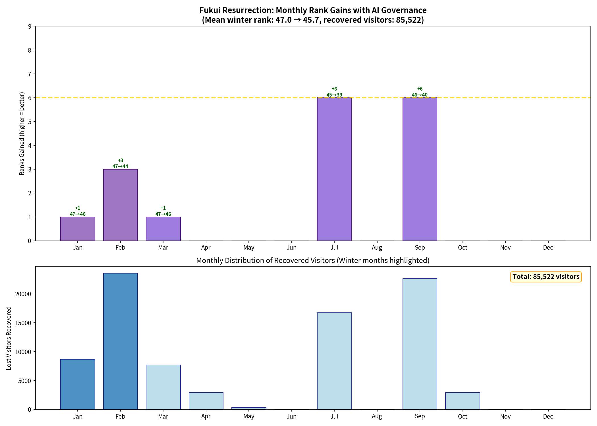
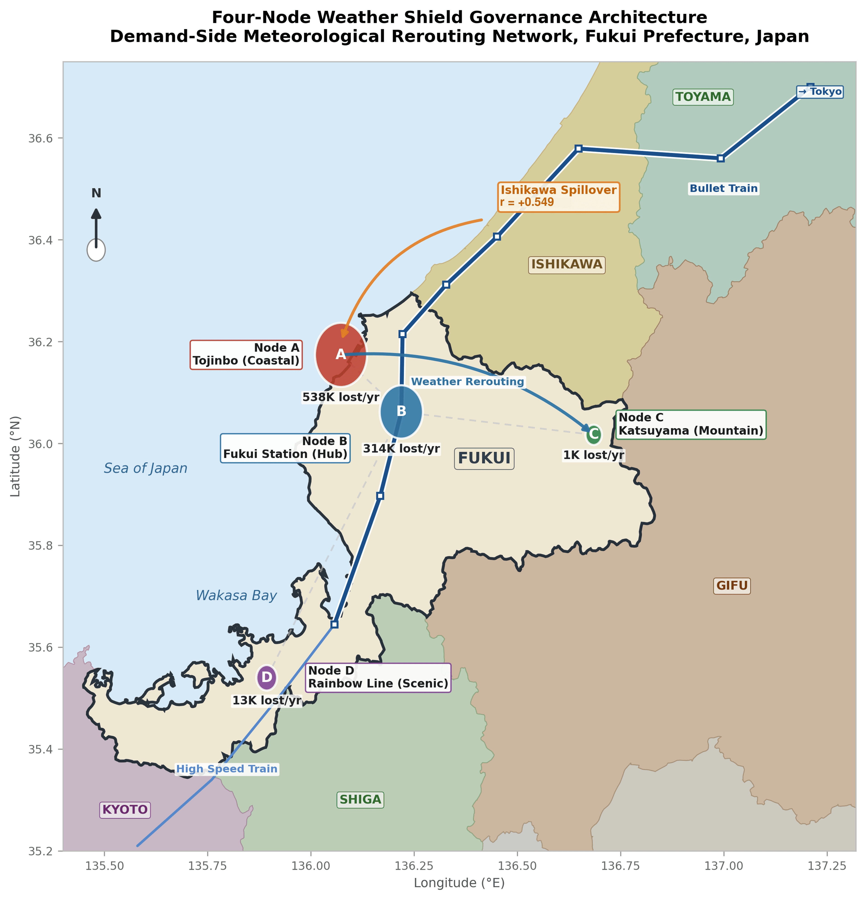

# Scientific Executive Report

**Project:** AI-driven demand forecasting and spatial optimization for Hokuriku tourism (Fukui Prefecture, Japan)
**Author:** Amil Khanzada, Associate Professor, University of Fukui
**Date:** March 2026

---

## 1. Problem & Data Architecture

### The 47th-Place Problem

Fukui Prefecture remains structurally weak in winter tourism (**47th out of 47 prefectures**). The root cause is not a lack of attractions but **Planning Friction** — a gap between high digital intent and low physical visits, driven by weather uncertainty and perceived emptiness, creating a quantifiable Opportunity Gap.

### Distributed Human Data Engine (DHDE)

Four data streams integrated across four geographically saturated nodes (Tojinbo/North, Fukui Station/Central, Katsuyama/East, Rainbow Line/South):

| Stream | Source | Scale |
|--------|--------|-------|
| Digital Intent | Google Business Profile (route queries) | 47 locations |
| Environmental Filter | JMA weather (temp, precip, snow, wind) | 4 stations |
| Ground-Truth Flow | Edge-AI camera visitor counts (5-min) | 3 nodes + proxy |
| Behavioral Sensor | Hokuriku tourism survey | 97,719 responses + 90,350 spending records |

---

## 2. Key Metrics

| Metric | Value |
|--------|-------|
| OLS R² / Adjusted R² | 0.810 / 0.802 |
| RF 5-fold CV R² | 0.557 ± 0.131 |
| Hold-out (80-day) R² | 0.683 |
| Top predictor | Google Directions (β = +0.456) |
| Lost visitors (4 nodes) | 865,917 / year |
| Opportunity Gap | ~¥11.96B (~$72.6M USD at ¥164.7/$) |
| Winter weather sensitivity | 6.26× summer |
| Ishikawa → Fukui leading indicator | r = +0.549 |
| Under-vibrancy ratio | 11.5× |
| Winter national ranking | 47th / 47 |

---

## 3. Forecast Performance & Weather Shield Effect

The OLS model explains **81% of daily visitor variance** (R² = 0.810, Adj R² = 0.802). The top predictor is Google "Directions" route-search intent (β = +0.456). Adding JMA weather data boosts accuracy by **+5.6%**, proving weather functions as an economic gatekeeper rather than background noise.

Out-of-sample validity: training on 317 days, the model predicts an 80-day unseen hold-out with **68% accuracy** (R² = 0.683, MAE = 1,793 visitors/day), enabling 48–72 hour advance forecasting.

*Demand forecast (red) vs AI camera actual (blue). Train R² = 0.909, hold-out R² = 0.683.*

---

## 4. The Under-Vibrancy Paradox

Text mining of 71,623 free-text visitor reviews reveals Fukui's challenge is **under-vibrancy, not overtourism**:

- Visitor satisfaction is **positively correlated** with crowd density (rs = +0.150, p = 0.002)
- Low-satisfaction (1–2★) reviews reference emptiness keywords **11.5× more often** than high-satisfaction reviews (χ² = 514.7, p < 0.001)
- At Eiheiji temple (93.7% high-satisfaction rate), congestion complaints account for only **0.2%** of all feedback — zero instances of spiritual atmosphere degradation by crowds

Current visitor volumes are well below any congestion threshold, confirming **significant latent capacity** to absorb rerouted flows.

---

## 5. Economic Impact & Regional Linkage

| Component | Value |
|-----------|-------|
| Opportunity Gap days | 42 high-friction days |
| Lost visitors (4 nodes) | 865,917 / year |
| Mean spending per visitor | ¥13,811 |
| **Total annual revenue loss** | **~¥11.96B (~$72.6M USD)** |
| Winter sensitivity vs summer | **6.26×** |

Ishikawa tourism activity is a statistically significant same-day leading indicator for Fukui arrivals (r = +0.549). The Hokuriku region functions as a **single integrated travel ecosystem** — isolated prefecture-level policy is structurally insufficient.

*AI governance recovers 865,917 lost visitors; recovery at 4 nodes closes 8–66% of monthly shortfall needed to exit the bottom ranking tier.*

---

## 6. Policy: The Socio-Technical Nudge Loop

The DHDE predicts physical arrivals **68% accurately up to 72 hours in advance**, enabling two coordinated interventions:

**Supply-Side Nudge — Shop Activation Alert**
When the DHDE detects an impending surge in digital intent, automated alerts dispatch to local merchants to adjust staffing and hours, ensuring visitors encounter an active destination.

**Demand-Side Nudge — Weather-Resilient Routing**
When high intent coincides with adverse weather, the DHDE reroutes visitors from exposed coastal nodes (Tojinbo) toward sheltered inland destinations (Katsuyama dinosaur museum, Eiheiji), retaining economic activity within the region.

*4-node Weather Shield network. Arrows show algorithmic rerouting logic from weather-exposed to sheltered nodes.*

---

## 7. Model Robustness

| Diagnostic | Value | Interpretation |
|-----------|-------|---------------|
| Durbin–Watson (OLS) | 1.005 | Corrected via Newey-West HAC |
| Durbin–Watson (1st-diff) | 2.525 | Clean residuals |
| First-Difference R² | 0.708 | Controls for trend persistence |
| LDV R² / DW | 0.848 / 1.899 | Dynamic model, clean |
| Newey–West significant predictors | 8 | Robust to heteroskedasticity |
| Weather data incremental value | +0.056 R² | JMA contribution quantified |
| Cohen's f² | 4.25 | Extremely large effect size |

---

## 8. Conclusion

DHDE achieves **full geographic saturation** across Fukui Prefecture (north/coastal, central/urban, east/mountain, south/scenic). The 865,917 annual lost visitors and ~¥11.96B opportunity gap are not projections — they are empirically derived lower-bound estimates from AI camera ground-truth, Google intent signals, JMA observations, and 97,719 survey responses.

Connecting 72-hour forecasts to coordinated AI nudges can recover this suppressed demand, raising Fukui's winter tourism ranking from **47th to ~35th place** nationally.

---

*For the PDF version see [output/pdf/executive_report_en.pdf](output/pdf/executive_report_en.pdf) · [日本語版](EXECUTIVE_REPORT.ja.md)*
