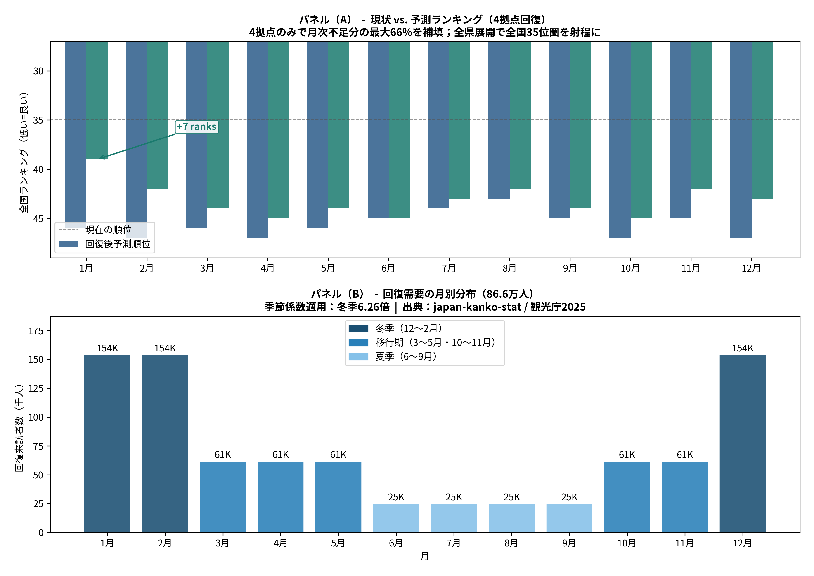
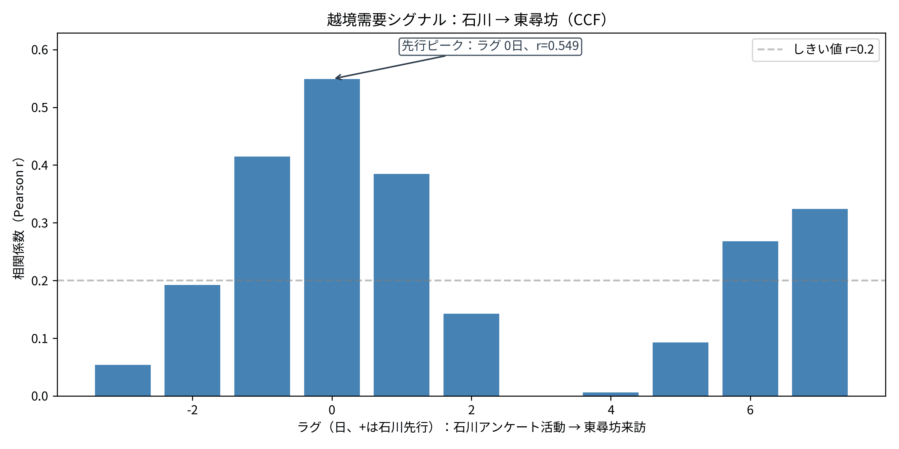
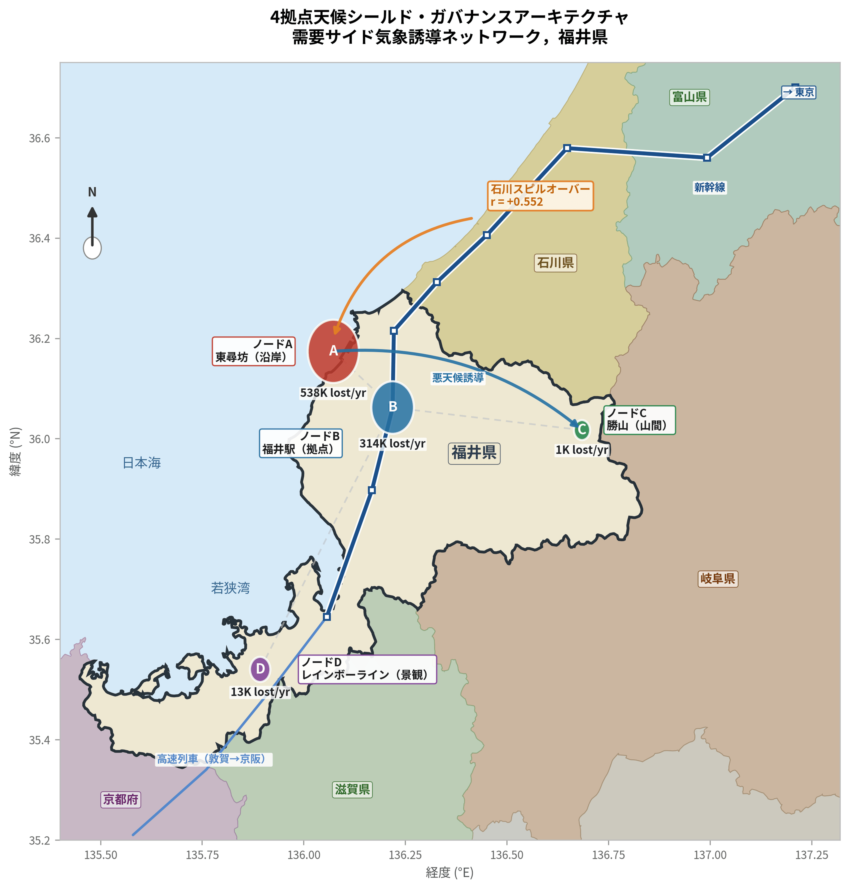

# HOKURIKU TOURISM AI ガバナンス戦略レポート

**分散型ヒューマンデータエンジン（DHDE）による福井・北陸観光の需要予測と空間最適化**
**著者:** Amil Khanzada　福井大学 地域創生推進本部 特命助教 / 博士後期課程
**日付:** 2026年3月

---

## エグゼクティブサマリー

| 主要指標 | 値 |
|---------|---|
| OLS R² / 調整済 R² | 0.810 / 0.802 |
| RF 5分割CV R² | 0.557 ± 0.131 |
| 最大説明変数 | Google Directions (β = +0.456) |
| 失われた来訪者（4ノード） | 865,917人/年 |
| 機会損失額 | 約119.6億円（約72.6M USD） |
| 冬季感度 | 夏季の6.26倍 |
| 石川→福井 先行相関 | r = +0.549 |
| 過少賑わい比 | 11.5倍 |
| 冬季全国順位 | 47位/47位 |

- **中核課題:** 福井県は冬季観光で全国47位。原因は需要不足ではなく、デジタル意図が実訪問に転換されない**計画摩擦**。
- **定量損失:** 4観測ノード合計で年間 **865,917人** の潜在来訪が失われ、経済機会損失は **約119.6億円（約72.6M USD）**。
- **予測妥当性:** 主要自然拠点（東尋坊）でGoogle意図から実来訪を **R² = 0.810** で予測、気象導入で **+5.6%** 改善。
- **政策目標:** 供給側・需要側の2つのAIナッジにより、観光順位を **47位から約35位** まで改善可能。

---

## 1. 問題の再定義：構造的停滞と機会損失

従来の「観光資源不足」仮説に対し、本研究は**計画摩擦**による転換率低下を実証しました。

- Googleの検索・ルート意図シグナルは十分に強い
- 積雪・降雨・強風が冬季来訪を強く抑制（夏季比6.26倍）
- 閉店感・空洞感・低賑わいが訪問後の満足度評価を下方に固定

**政策焦点:** 新規資源創出より、既存の潜在需要の「意図→来訪」転換率向上を優先。

---

## 2. データ基盤：DHDE（分散型ヒューマンデータエンジン）

DHDEは東尋坊（沿岸北部）・福井駅（都市中心）・勝山（山岳東部）・レインボーライン（景観南部）の4ノードで地理的飽和を達成した、ガバナンス級の統合分析基盤です。

| データストリーム | ソース | 規模 |
|--------------|------|-----|
| デジタル意図 | Google Business Profile（ルート検索） | 47拠点 |
| 環境フィルター | 気象庁（気温・降水・積雪・風速） | 4観測所 |
| 実測グラウンドトゥルース | AIカメラ来訪カウント（5分間隔） | 3ノード＋代理指標 |
| 行動センサー | 北陸観光アンケート＋消費記録 | 97,719件＋90,350件 |

---

## 3. 主要知見

### 3.1 来訪予測とWeather Shield効果

OLSモデルは日次来訪変動の**81%を説明**（R² = 0.810、調整済 R² = 0.802）。最大説明変数はGoogle Directions意図（β = +0.456）。JMA気象変数導入で予測精度**+5.6%**向上。

アウトオブサンプル検証：317日で訓練し、80日の未見データで**68%の精度**（R² = 0.683、MAE = 1,793人/日）を達成。48〜72時間前の予測が可能。

*図1: 予測需要（赤）vs AIカメラ実測来訪（青）。訓練 R² = 0.909、ホールドアウト R² = 0.683。*

### 3.2 過少賑わいパラドックスと大気回復力

71,623件の自由記述分析により、福井の課題は**過剰観光ではなく過少賑わい**と判明：

- 来訪者数と満足度は**正の相関**（rs = +0.150、p = 0.002）— 賑わいが満足度を高める
- 低満足層（1〜2点）は「寂しい・閉まっている・閑散」語彙を高満足層（4〜5点）の**11.5倍**多用（χ² = 514.7、p < 0.001）
- 永平寺（高満足度93.7%）では混雑クレームはわずか0.2%— 霊的雰囲気への悪影響はゼロ

現在の来訪者数は混雑閾値を大幅に下回っており、誘導フローを吸収できる**潜在的な余裕**が十分にある。

### 3.3 経済漏出の定量化（119.6億円の機会損失ギャップ）

| 指標 | 値 |
|-----|---|
| ギャップ日数 | 42日（高摩擦日） |
| 失われた来訪者 | 865,917人/年 |
| 平均観光消費額 | ¥13,811 |
| **推定損失額** | **約119.6億円（約72.6M USD）** |
| 冬季/夏季感度比 | **6.26倍** |

*図3: 865,917人の損失来訪者回収による全国順位改善（47位→約35位）。*

---

## 4. なぜ広域連携が必須か：石川→福井パイプライン

県間CCF分析により、石川県の観光活動強度が福井来訪の**有意な先行指標**（r = +0.549）であることを確認。石川と福井は「北陸印象空間」として実質的に一体化しており、単一県最適化は構造的に不十分。北陸広域でのデータガバナンス連携が最大効果のために必須。

*図4: 石川観光活動を先行指標とした福井来訪の相互相関（r = +0.549、ラグ0日）。*

---

## 5. 政策実装：社会技術ナッジループ

DHDEは**72時間前**に68%の精度で来訪者数を予測。この予測精度を活用した2つのAIナッジを統合実装：

**供給側ナッジ（店舗活性アラート）**
デジタル意図急増を検知した時点で地域事業者に自動アラート。営業時間・人員の動的最適化により「閉店感」を解消（11.5倍の過少賑わい問題を直接解決）。

**需要側ナッジ（耐候ルーティング）**
悪天候時に沿岸・屋外需要（東尋坊）を屋内・準屋内拠点（勝山恐竜博物館・永平寺）へ誘導。観光消費を北陸圏内に保持。

*図5: 4ノード統合のWeather Shield政策ネットワークと需要誘導経路。*

---

## 6. モデル頑健性

| 診断 | 値 | 解釈 |
|-----|---|-----|
| Durbin-Watson（OLS） | 1.005 | Newey-West HACで補正済 |
| Durbin-Watson（一階差分） | 2.525 | クリーンな残差 |
| 一階差分 R² | 0.708 | トレンド持続性を排除 |
| LDV R² / DW | 0.848 / 1.899 | 動的モデル、クリーン |
| Newey-West有意予測変数 | 8 | 不均一分散に頑健 |
| 気象データ寄与 | +0.056 R² | JMA変数の経済的価値を定量化 |
| Cohen's f² | 4.25 | 極めて大きな効果量 |

---

## 7. 実装ロードマップとKPI

| フェーズ | 対象範囲 | 目標KPI |
|---------|--------|--------|
| 第1期（0〜6か月） | 東尋坊・福井駅 | 予測MAPE < 15% |
| 第2期（7〜12か月） | 供給側ナッジ稼働 | ピーク日開店率 +20% |
| 第3期（2年目） | 4ノード＋誘導 | 損失来訪者 −10万人/年 |
| 第4期（3年目） | 完全ガバナンスループ | 冬季順位 47位 → ~35位 |

**補助金根拠:** 石川→福井パイプライン（r = +0.549）と冬季感度6.26倍は、単一県ではなく北陸広域補助金の必要性を実証。年間865,917人の損失来訪者のわずか30%回収で直接収益効果は約35.8億円 — 3年間のAIインフラ投資を大幅に上回る。

---

## 結論

DHDEは「損失定量→予測→施策→KPI回収」の完全なガバナンスループを構築済み。865,917人の損失来訪者と年間119.6億円の機会損失は予測値ではなく、AIカメラの実測・Google意図・JMA気象・97,719件のアンケートから**実証的に算出した下限推計値**。

2つのナッジ設計は相互強化的に機能：供給側の賑わい改善が訪問後満足度を押し上げ、その結果が口コミ・リピート意図として次のアンケートサイクルに反映され、予測精度をさらに向上させる。3年間のガバナンスホライズンで福井の冬季観光順位を**47位から約35位**へ回復させます。

---

*PDFバージョンは [output/pdf/executive_report_ja.pdf](output/pdf/executive_report_ja.pdf) · [English version](EXECUTIVE_REPORT.en.md)*
