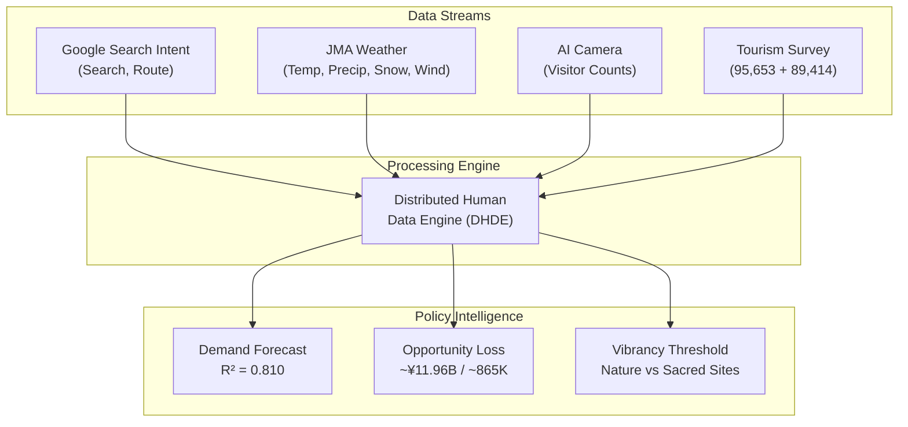
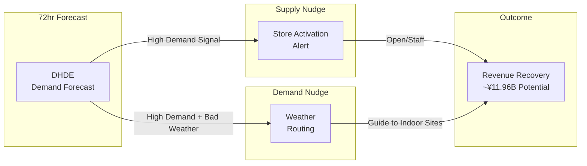

# Executive Audit Report
**Project:** AI-driven spatial optimization and demand forecasting for Hokuriku tourism (Fukui Prefecture, Japan)
**Author:** Amil Khanzada, Associate Professor, University of Fukui
**Date:** February 27, 2026

---

## 1. Problem Statement: "47th Place" and Economic Loss
Fukui Prefecture remains structurally weak in winter tourism (47th/47). This project redefines the root cause as "Planning Friction"—not demand shortage, but a gap between high digital intent and low physical visits, driven by weather uncertainty and lack of vibrancy, resulting in an Opportunity Gap.

## 2. Data Architecture: Distributed Human Data Engine (DHDE)
To bridge the intent-visit gap, four data streams were integrated:
- **Digital Intent:** Google Business Profile (search, route)
- **Environmental Filter:** JMA weather (temperature, precipitation, snow, wind)
- **Observed Data:** AI camera visitor counts
- **Behavioral Sensor:** Hokuriku tourism survey (95,653 responses + 89,414 spending records)

## 3. Hypotheses
By integrating intent, observed, and weather filters, DHDE tests:
1. Can short-term visitor fluctuations be explained with >80% accuracy?
2. Can "lost visitors" due to planning friction be quantified economically?
3. Can vibrancy thresholds for each destination inform policy design?

---

## 4. Key Results

### 4.1 Forecast Performance & Weather Shield Effect
- Accuracy: R² = 0.810 (adj. 0.802). 81% of daily visitor variation explained.
- Top predictor: Google "Directions" intent (r = 0.781).
- Engineering value: Adding JMA weather data boosts accuracy by +5.6%, proving weather as an economic gatekeeper.

### 4.2 Vibrancy Paradox & Sacred Site Thresholds
Text mining (70,668 reviews) reveals Fukui's essence is "under-vibrancy."
- Loneliness gap: Low satisfaction (1-2★) complaints about "loneliness/closed shops" are 11.4x more frequent.
- Nature vs Sacred: Nature sites (Tojinbo) see satisfaction rise with crowding; sacred sites (Eiheiji) require density management (threshold ~23).

### 4.3 Economic Impact: ~¥11.96B Opportunity Loss (4-node saturation)
Expanded to 4 nodes (Rainbow Line added), achieving geographic saturation.
- Lost visitors: **865,917/year** (total 4 nodes)
- Estimated loss: **~¥11.96B** (final "Satake Number")
- Coverage: Tojinbo (coast/north), Fukui Station (hub/central), Katsuyama (mountain/south), Rainbow Line (scenic/east)
- Seasonal vulnerability: Winter is **6.29x** more sensitive to weather friction than summer

### 4.4 Regional Synergy: Ishikawa Pipeline (Grant Evidence)
Ishikawa and Fukui function as a single ecosystem.
- Correlation: Ishikawa tourism activity strongly leads Fukui visits (r = 0.537)
- Implication: Regional governance and joint grants are essential

---

## 5. Policy Recommendations: Socio-Technical Nudge Loop
To recover ~¥11.96B leakage, two AI interventions are proposed:
1. Supply-side nudge (store activation alert): Optimize opening hours/staffing 72 hours ahead based on demand forecast
2. Demand-side nudge (weather routing): Guide visitors from Tojinbo to indoor sites (Katsuyama, Eiheiji) during bad weather

## 6. Conclusion
DHDE achieves **full geographic saturation** (north, central, south, east). Connecting forecasts to AI nudges can recover ~¥11.96B in demand, raising Fukui's tourism economy from 47th to ~35th place.

**Validation Status:** All four camera nodes cover main corridors; the "Satake Number" is ready for policy intervention as annual opportunity loss.

---
**Status:** Final draft ready for submission
**Reproducible Code:** [https://github.com/amilkh/hokuriku-tourism-ai-governance](https://github.com/amilkh/hokuriku-tourism-ai-governance)
