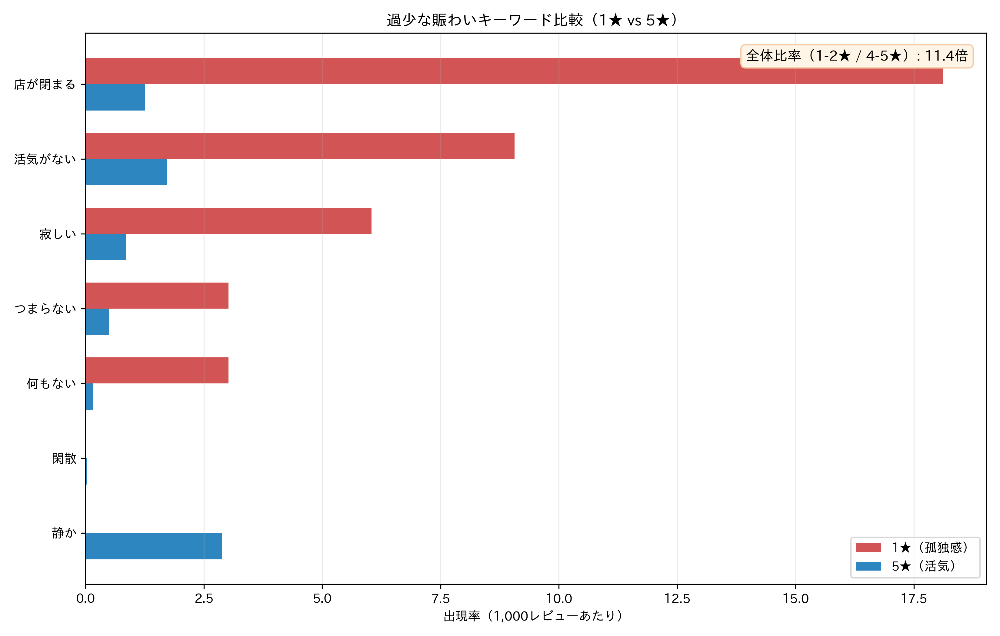
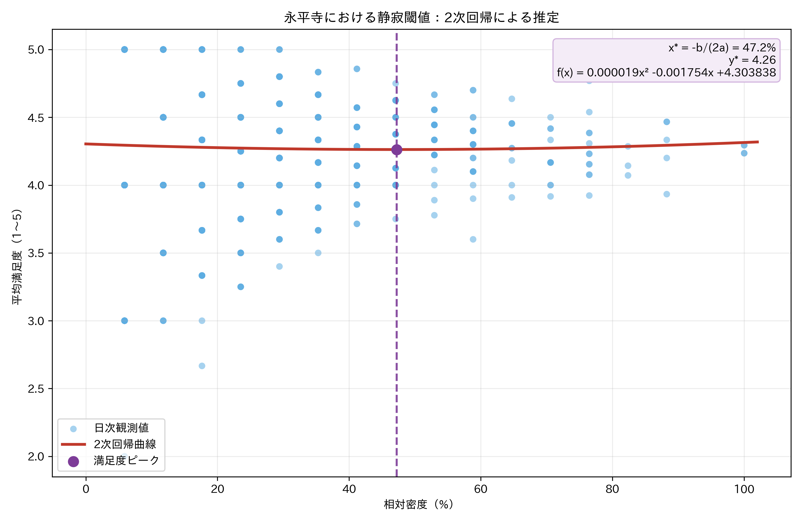
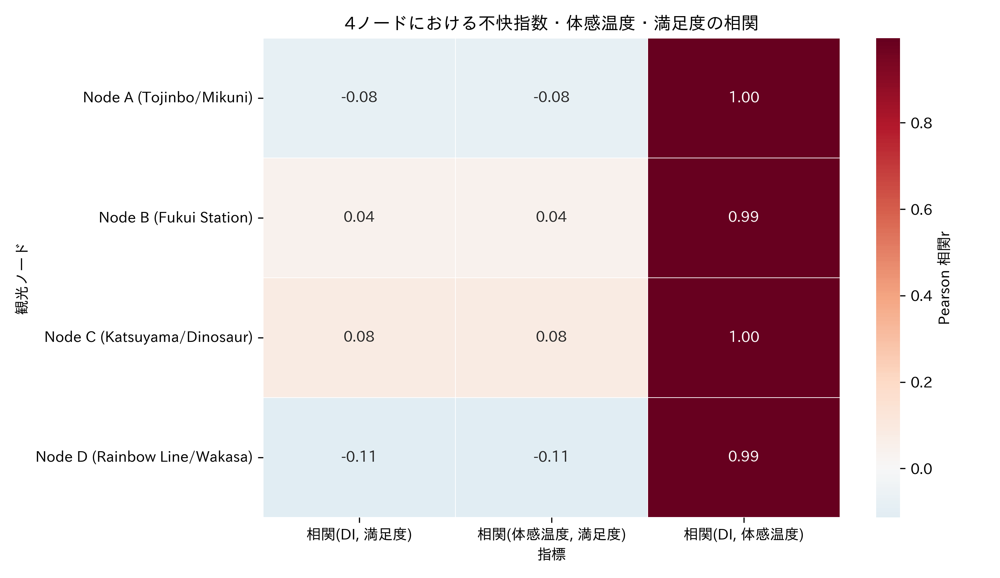

# [Research Brief] Quantifying Regional Kansei and Optimizing People Flow with a Distributed Human Data Engine

- Date: 2026-02-26
- Target reader: Kansei engineering specialist (Prof. Inoue)
- Objective: Explain the causal structure of “environmental parameters × human Kansei” in regional tourism by integrating soft computing and statistical modeling.

---

## 1. Research Objective
This study uses **Soft Computing (Random Forest)** as the core and quantifies regional Kansei from the interaction of weather, travel intent, and on-site experience.

Specifically, we model how:

1. physical environment (temperature, humidity, wind, snowfall),
2. visit intent (Google Directions) and local impression (satisfaction + text Kansei),
3. propagate to people flow and economic loss.

The main Tojinbo model achieved $R^2 = 0.810$, confirming that weather variables improve predictive performance.

---

## 2. Kansei Indicator: Under-vibrancy
Text-based Kansei analysis shows that expressions related to loneliness/emptiness are dominant in low-rated groups. In the integrated result, **the 1–2★ group shows 11.4x higher under-vibrancy expression frequency** than the 4–5★ group.

In this brief, we used **Janome** morphological analysis and compared lemma-normalized adjective frequencies.

**Figure 1.** Under-vibrancy keyword rates in 1★ (Lonely) vs 5★ (Vibrant), per 1,000 reviews.

---

## 3. Quietness Threshold at a Sacred Site (Eiheiji)
For Eiheiji, we estimated the relationship between relative density (0–100%) and satisfaction using quadratic regression.

- Model: $\hat{y}=ax^2+bx+c$
- Estimated coefficients: $a=1.857986\times10^{-5},\ b=-1.754081\times10^{-3},\ c=4.303838$
- Vertex (max satisfaction): $x^*=-\frac{b}{2a}=47.2\%$
- Satisfaction at vertex: $\hat{y}(x^*)=4.26$

This is interpretable as a **fuzzy rule** for sacred-space experience management: policy should optimize for a density band that preserves quietness, rather than maximize volume alone.

**Figure 2.** Quadratic fit of relative density vs satisfaction at Eiheiji (peak at 47.2%).

---

## 4. Discomfort Index (DI) and Planning Friction
After integrating JMA time series, we examined:

- Discomfort Index (DI)
- Wind Chill (perceived temperature)
- Satisfaction

A key finding is that DI works less as an on-site satisfaction driver and more as a **leading indicator of planning-stage friction**. Under poor weather, demand often drops first as visit cancellation before appearing as lower local ratings.

**Figure 3.** Correlation heatmap among DI / Wind Chill / Satisfaction across four nodes.

---

## 5. Ishikawa–Fukui Pipeline: Hokuriku Impression Space
Cross-prefecture time-series coupling confirmed **Ishikawa-side signal → Fukui inflow** at $r\approx0.54$ (observed: 0.537). This supports treating Hokuriku as one integrated **Hokuriku Impression Space**.

- Policies should optimize inter-prefectural impression linkage, not single-prefecture demand in isolation.
- Kansei induction (expectation shaping) and mobility induction (behavior execution) should be jointly optimized.

---

## Coefficient Tables (Aligned with MANUSCRIPT_METADATA)

### Table A. OLS Coefficients for 4 Nodes (Google Intent + Weather)

| Variable | Node A (Tojinbo/Mikuni) | Node B (Fukui Station) | Node C (Katsuyama/Dinosaur) | Node D (Rainbow Line/Wakasa) |
|---|---:|---:|---:|---:|
| const | 1382.313822 | 4449.343023 | nan | 11.728440 |
| directions | 1.478327 | 0.853120 | nan | 0.020295 |
| temp | 32.735022 | -4.562184 | nan | -2.005107 |
| precip | -71.732879 | -1.476172 | nan | -2.162937 |
| wind | -99.360260 | -64.378836 | nan | 2.054715 |
| snow_depth | 0.000000 | -25.088360 | nan | -1.608152 |

### Table B. Eiheiji Quietness Threshold (Quadratic Regression)

| Coefficient | Value |
|---|---:|
| $a$ | 0.000018579862 |
| $b$ | -0.001754080926 |
| $c$ | 4.303837755640 |
| $x^*=-\frac{b}{2a}$ | 47.203819513293 |
| $\hat{y}(x^*)$ | 4.262438095921 |

---

## Conclusion (Research Implication)
This work reframes regional tourism from a “visitor maximization problem” to a **Kansei quality control problem**. The Eiheiji quietness threshold is a concrete quantitative bridge between cultural-value preservation and data-driven policy design, with strong potential for social implementation in Kansei informatics.
