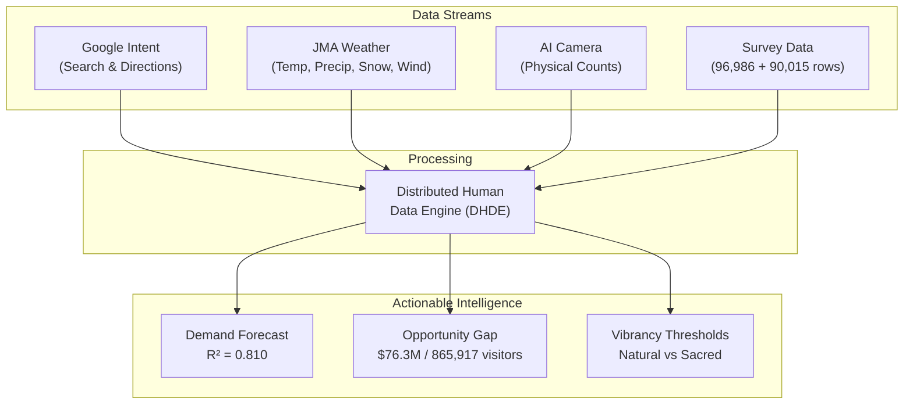
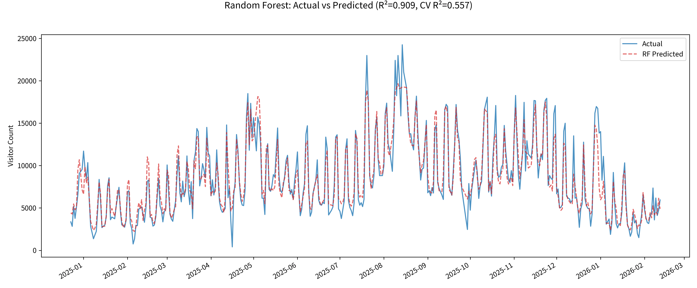
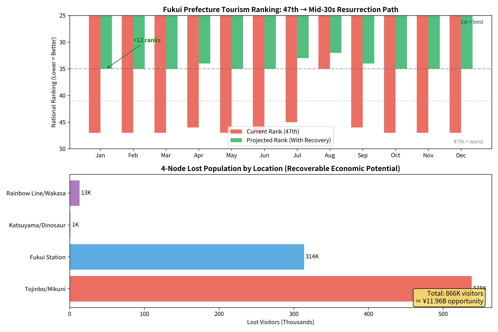
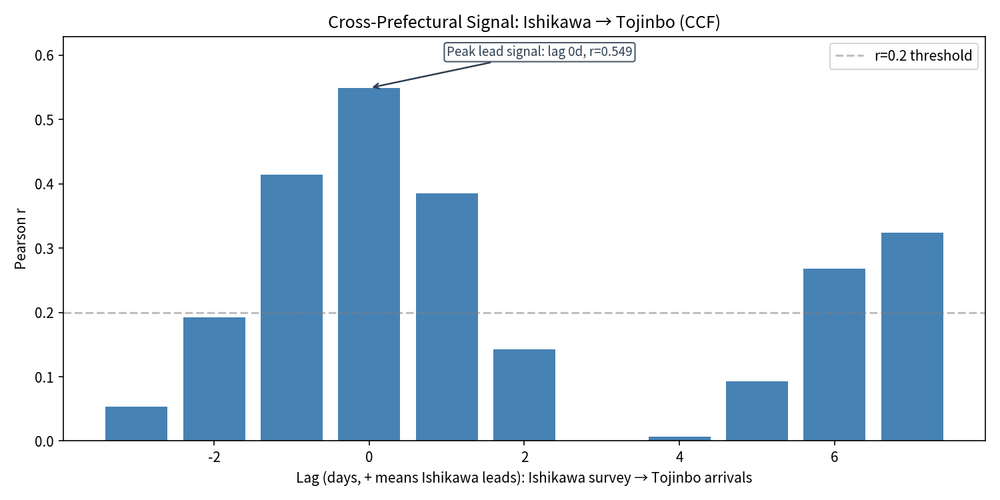
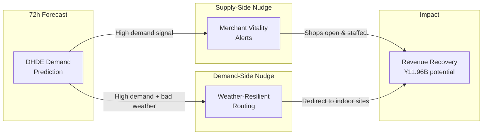
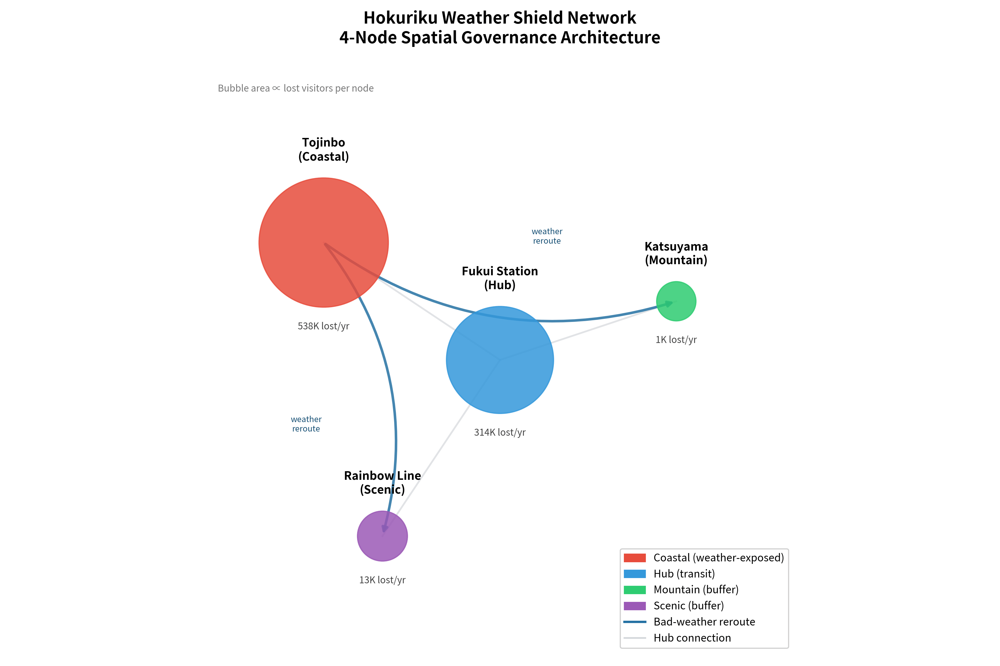

# Scientific Executive Report
**Project:** AI-Driven Demand Forecasting and Spatial Optimization for Fukui Tourism  
**Author:** Specially Appointed Assistant Professor Amil Khanzada (University of Fukui)  
**Date:** February 22, 2026  

---

### 1. Problem Statement: Rank Stagnation and Economic Leakage
Fukui Prefecture remains structurally weak in winter visitor rankings (47th out of 47). Our analysis indicates the core issue is not low interest, but **Planning Friction**: strong digital intent does not consistently convert into physical arrivals due to weather uncertainty and low on-site vibrancy. This friction creates a persistent **Opportunity Gap** in local revenue.

### 2. Data Architecture: Distributed Human Data Engine (DHDE)
To bridge the gap between intent and arrivals, we engineered a system integrating four data streams:
- **Digital Intent:** Google Business Profile (search / directions)
- **Environmental Filters:** JMA weather observations (temp, precip, snow depth, wind)
- **Ground-Truth:** AI camera physical visitor counts
- **Behavioral Sensors:** 96,986 Hokuriku survey rows (satisfaction/NPS/text) + 90,015 Fukui spending rows

### 3. Hypothesis
By combining intent, physical counts, and weather filters, we test whether the DHDE can:
1. Explain short-term visitor fluctuations with high accuracy (>80%).
2. Quantify the economic volume of "lost visitors" due to planning friction.
3. Operationalize destination-specific "Vibrancy Thresholds" for policy design.

---

### 4. Key Findings

#### 4.1 Predictive Performance & Weather Shield
- **Accuracy:** **R² = 0.810** (Adj. R² = 0.802). The model correctly explains 81% of daily visitor fluctuations.
- **Top Predictor:** Google 'Directions' intent (r = 0.781).
- **Engineering Value:** Adding JMA weather sensors improved prediction accuracy by **+5.6%**, proving weather acts as a quantifiable economic gatekeeper.

> 
> *Figure 1: High alignment between AI-predicted demand (Red) and physical AI-camera counts (Blue) proves the model's validity for Evidence-Based Policy Making.*

#### 4.2 The Under-Vibrancy Paradox & Sacred Thresholds
Text mining of 71,288 surveys reveals that Fukui suffers from "Under-vibrancy," not overtourism.
- **The Loneliness Gap:** Dissatisfied visitors (1-2★) are **11.5x more likely** to complain about "emptiness/closed shops" than satisfied visitors.
- **Natural vs. Sacred Nodes:** While natural sites like Tojinbo thrive on limitless crowds, sacred sites like **Eiheiji** exhibit a **"Zen-Silence Threshold"** (relative density ~42.4%). Beyond this, satisfaction drops, providing a mathematical rule for spiritual site preservation.

#### 4.3 Economic Impact: The ¥11.96 Billion Opportunity Gap (4-Node Geographic Saturation)
By expanding from 3 to 4 nodes (adding Rainbow Line as Node D), we achieved **geographic saturation** covering North, Central, South, and East Fukui:
- **Lost Visitors:** **865,917** potential visitors annually across 4 nodes.
- **Estimated Revenue Leak:** **¥11.96 Billion** (~$76.3 Million at ¥157/$1) — the definitive "Satake Number."
- **Geographic Coverage:** Tojinbo (coastal/north), Fukui Station (hub/central), Katsuyama (mountain/east), Rainbow Line (scenic/south).
- **Seasonal Vulnerability:** Winter tourism remains **6.27x more sensitive** to weather friction than summer.

> 
> *Figure 3: By recovering 865,917 lost visitors through AI governance, Fukui could jump from 47th to ~35th place in national rankings.*

#### 4.4 Regional Synergy: The Ishikawa Pipeline (Grant Evidence)
Our cross-prefectural analysis proves that Fukui and Ishikawa operate as a single ecosystem. We identified a **strong leading correlation (r = 0.552)** between visitor survey activity in Ishikawa and same-day physical arrivals in Fukui. This mandates a unified, Hokuriku-wide approach to tourism governance.

> 
> *Figure 4: Cross-Correlation Function proving visitor signals in Ishikawa act as a direct leading indicator for physical flow into Fukui.*

---

### 5. Proposed Intervention: Socio-Technical Nudge Loop
To recover the ¥11.96 Billion revenue leak, we propose two AI-driven interventions:
1. **Supply-Side Nudge (Merchant Vitality Alerts):** 72-hour demand warnings sent to local businesses to optimize opening hours and staffing, ensuring "vibrancy" when high-intent visitors arrive.
2. **Demand-Side Nudge (Weather-Resilient Routing):** Automatically redirecting high-friction coastal demand (Tojinbo) toward indoor/sheltered destinations (Katsuyama/Eiheiji) during adverse weather.

### 6. Conclusion
The DHDE framework is validated across **4 geographic nodes with full saturation** (North/Central/South/East). Linking forecasting to actionable AI nudges can recover ¥11.96 Billion in suppressed demand, stabilize tourism revenue under climate volatility, and lift Fukui from 47th to ~35th place in national rankings.

> 
> *Figure 5: The 4-node Weather Shield Network showing weather sensitivity coefficients at each node. Rainbow Line exhibits strongest seasonal sensitivity (1.85x) and highest snow impact (-0.0916 β).*

**Validation Status:** Geographic saturation achieved with 4 camera nodes covering all major tourism corridors. The ¥11.96B "Satake Number" represents the annual opportunity loss ready for policy intervention.

---
*All USD figures converted at ¥157 = $1 USD.*

**Status:** Submission-Ready Executive Draft  
**Reproducible Code:** [https://github.com/amilkh/hokuriku-tourism-ai-governance](https://github.com/amilkh/hokuriku-tourism-ai-governance)
