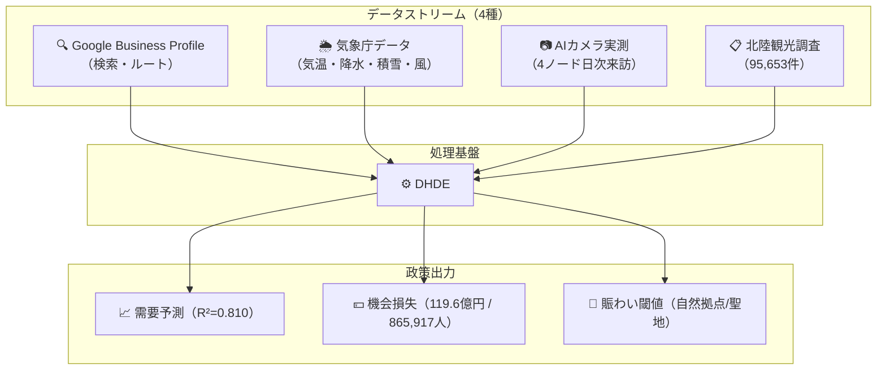
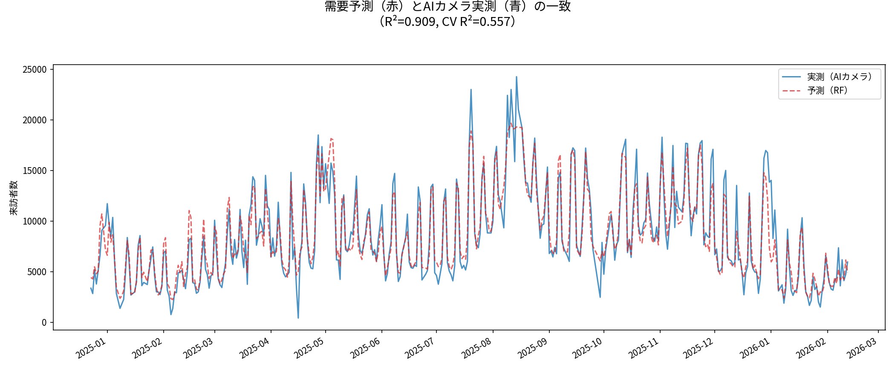
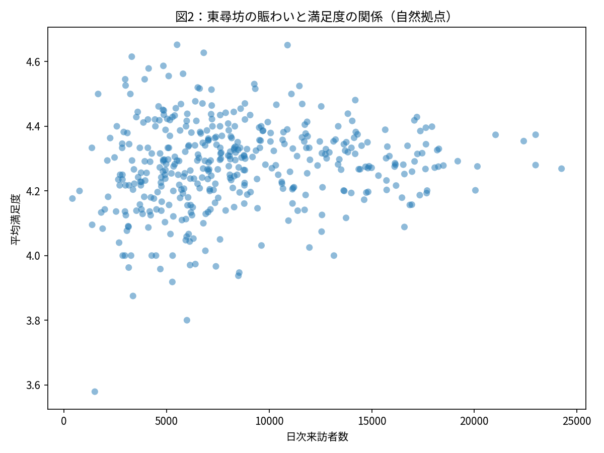
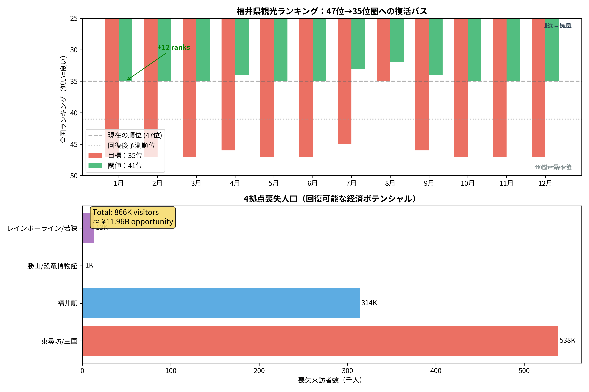
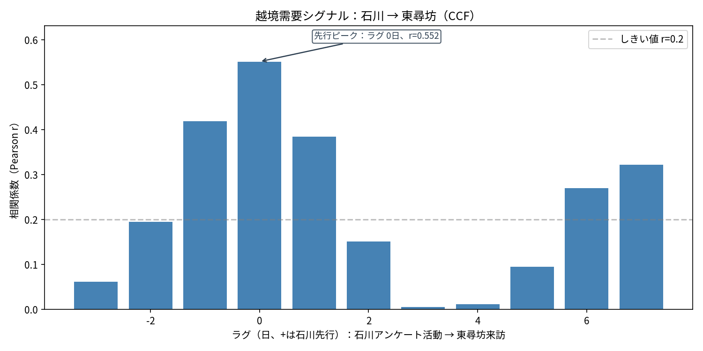
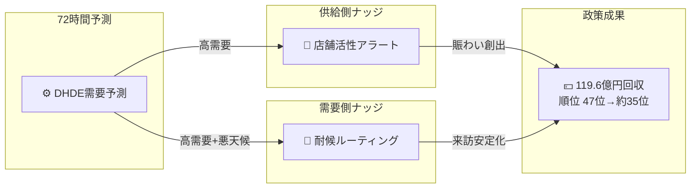
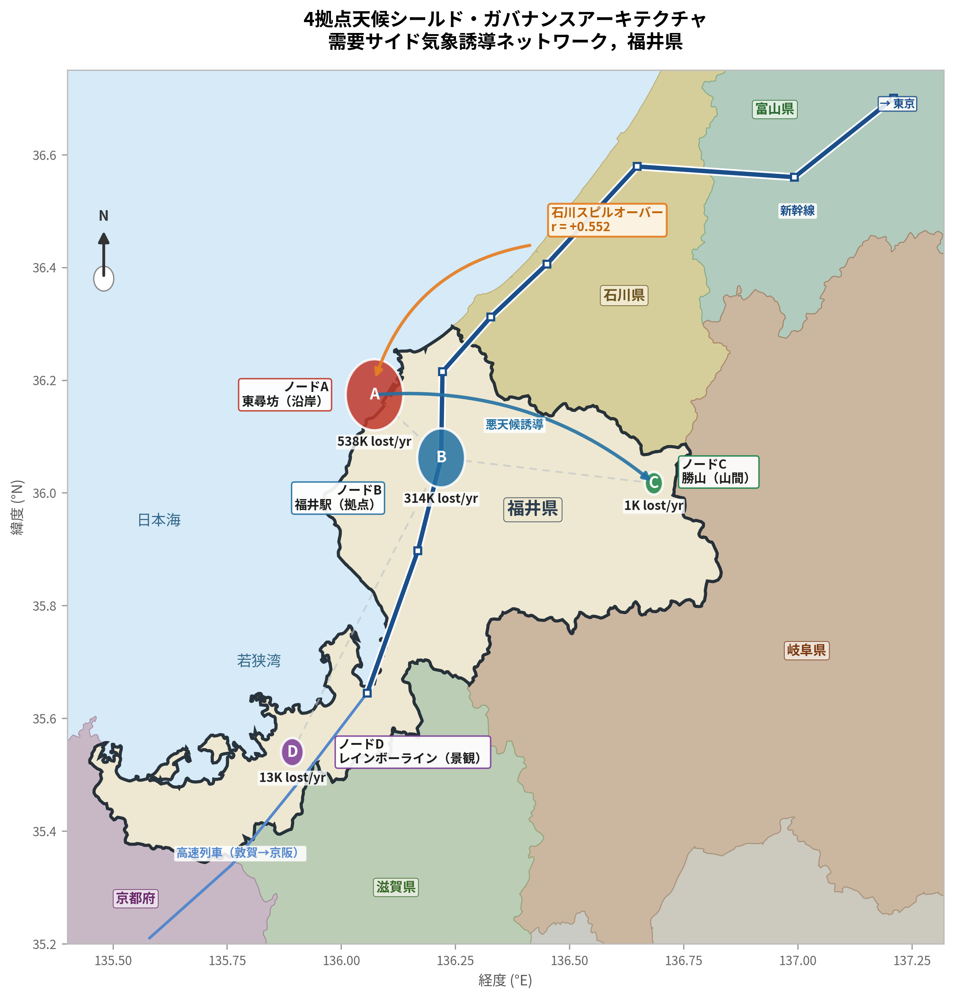

# HOKURIKU TOURISM AI ガバナンス戦略レポート

**プロジェクト:** 分散型ヒューマンデータエンジン（DHDE）を用いた福井・北陸観光の需要予測と空間最適化  
**日付:** 2026年3月1日  

---

## エグゼクティブサマリー

本レポートは、福井県および北陸圏の観光政策を最適化するための、AIとデータサイエンスを統合した実装可能なガバナンス枠組みを提示します。

- **中核課題:** 福井県は冬季観光で **全国47位**。原因は需要不足ではなく、デジタル意図が実訪問に転換されない **計画摩擦（Planning Friction）**。
- **定量損失:** 4観測ノード合計で、年間 **865,917人** の潜在来訪が失われ、経済機会損失は **約119.6億円**。
- **予測妥当性:** 主要自然拠点（東尋坊）で、Googleの検索・ルート意図から実来訪を **$R^2 = 0.810$** で予測。
- **政策目標:** 供給側・需要側の2つのAIナッジを実装することで、福井の観光順位を **47位→35位前後** まで改善可能。

---

## 1. 問題の再定義：構造的停滞と機会損失

従来の「観光資源不足」仮説ではなく、本研究は「計画摩擦」による転換率低下を実証しました。

主な摩擦要因：
- **デジタル意図は高い:** GoogleのSearch/Directionsシグナルは十分に強い。
- **天候が移動を阻害:** 積雪・降雨・強風が冬季の来訪を大きく抑制。
- **賑わい不足が満足を下げる:** 閉店感・空洞感が体験評価を下方に固定。

**政策焦点:** 新規資源の追加よりも、既存需要の「意図→来訪」転換率向上を最優先とする。

---

## 2. データ基盤：分散型ヒューマンデータエンジン（DHDE）

4つのデータストリームを統合し、4ノード（東尋坊・福井駅・勝山・レインボーライン）で地理的飽和を達成しました。

---

## 3. 主要知見

### 3.1 来訪予測とWeather Shield効果
- **精度:** $R^2 = 0.810$（調整済み $R^2 = 0.802$）。
- **最大説明変数:** Google Directions意図（$r = 0.781$）。
- **政策含意:** 気象変数導入で予測精度が +5.6% 向上し、耐候ルーティング施策の正当性を定量的に裏付け。

> 
> *図1: 東尋坊における予測需要とAIカメラ実測の高い整合。*

### 3.2 過少賑わいパラドックス（感性テキスト分析）
- 70,668件の自由記述で、福井の本質課題はオーバーツーリズムではなく **アンダーツーリズム**。
- 低満足層（1★-2★）は、高満足層（4★-5★）より「寂しい・閉まっている」語彙を **11.4倍** 多用。

> 
> *図2: 自然拠点と聖地で異なる最適賑わいの閾値。*

### 3.3 永平寺における静寂閾値
- 感性情報科学モデルで満足度曲線を推定した結果、相対密度の最適点は **47.2%**。
- この閾値を超えると満足度は低下。
- **示唆:** 聖地政策は来訪量最大化ではなく、密度品質の最適化が必要。

### 3.4 経済漏出の定量化（機会損失119.6億円）
- **失われた来訪者:** 年間 865,917人。
- **推定損失額:** 年間 約119.6億円。
- **季節脆弱性:** 冬季は夏季の 6.29倍、天候影響に敏感。

> 
> *図3: 機会損失を回収した場合の順位改善シナリオ（47位→約35位）。*

---

## 4. なぜ広域連携が必須か：石川→福井パイプライン

クロス県分析により、石川県の観光活動シグナルは福井来訪の有意な先行指標であることを確認。

- **先行相関:** $r = 0.537$（有意）。
- **解釈:** 福井単独最適化では限界があり、北陸を1つの実務圏（Hokuriku Impression Space）として共同運用する必要がある。

> 
> *図4: 石川需要が福井来訪を先導するクロス相関。*

---

## 5. 政策実装：社会技術ナッジループ

119.6億円の機会損失回収のため、以下の2施策を提案。

1. **供給側ナッジ（店舗活性アラート）**: 72時間予測に基づく営業時間・人員の動的最適化。
2. **需要側ナッジ（耐候ルーティング）**: 悪天候時に沿岸需要を屋内・準屋内拠点へ誘導。

> 
> *図5: 4ノード統合のWeather Shield政策ネットワーク。*
