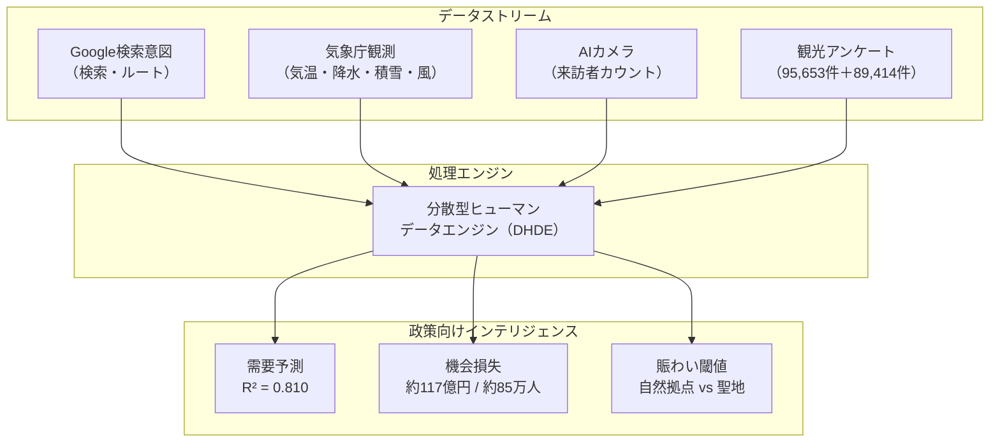
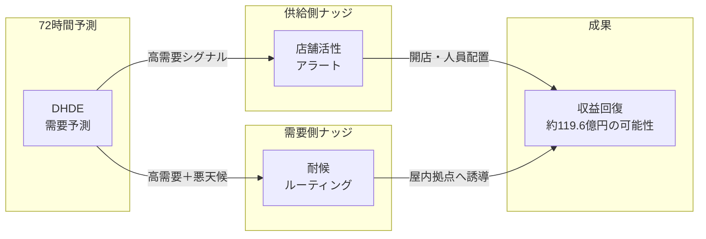

# 科学的エグゼクティブレポート
**プロジェクト:** 福井観光の需要予測と空間最適化を目的としたAI主導の分析  
**著者:** 福井大学 特命准教授 Amil Khanzada  
**日付:** 2026年2月22日  

---

### 1. 課題：「47位」と経済的損失
福井県は冬季の観光客数ランキングで構造的に弱い（47位/47）状態が続いています。本研究では、根本原因を需要不足ではなく「計画の摩擦（Planning Friction）」と定義しました。デジタル上の訪問意図は高い一方で、天候不確実性と現地の賑わい不足が実訪問を阻み、機会損失（Opportunity Gap）を生んでいます。

### 2. データアーキテクチャ：分散型ヒューマンデータエンジン（DHDE）
意図と来訪のギャップを埋めるため、以下の4データストリームを統合しました。
- **デジタルインテント:** Google Business Profile（検索・ルート）
- **環境フィルター:** 気象庁（JMA）観測（気温・降水・積雪・風）
- **実測データ:** AIカメラによる来訪者カウント
- **行動センサー:** 北陸観光アンケート 95,653件（満足度/NPS/自由記述）＋福井消費データ 89,414件

### 3. 仮説
意図、実測、気象フィルターを統合することで、DHDEは以下を達成できるかを検証しました。
1. 来訪者数の短期変動を高精度（80%以上）で説明できるか
2. 計画摩擦による「失われた訪問者」を経済価値として定量化できるか
3. 目的地ごとの「賑わい閾値」を政策設計へ接続できるか

---

### 4. 主要結果

#### 4.1 予測性能と気象シールド効果
- 精度: R² = 0.810（調整済み 0.802）。日次来訪変動の81%を説明。
- 最大予測因子: Google「Directions」意図（r = 0.781）。
- 工学的価値: JMA気象データの追加で精度が+5.6%向上し、天候が経済のゲートキーパーであることを定量的に証明。

> 
> *図1: 需要予測（赤）とAIカメラ実測（青）の高い一致は、EBPMにおける有効性を示す。*

#### 4.2 過少な賑わいパラドックスと聖地閾値
70,668件のテキスト分析から、福井の本質は「過少な賑わい」であると判明。
- ロンリネス・ギャップ: 低満足（1-2★）は「寂しい/店が閉まっている」不満が11.4倍多い。
- 自然 vs 聖地: 自然拠点（東尋坊）は混雑で満足が上がる一方、永平寺は「禅の静寂閾値」（相対密度 ~23）を超えると満足が低下し、聖地保全の数理ルールを提供。

> 
> *図2: 東尋坊は賑わいで満足度が上昇（自然拠点）、永平寺は密度管理が必要（聖地）。*

#### 4.3 経済インパクト：約119.6億円の機会損失（4ノード地理的飽和）
4ノード（レインボーラインをノードDとして追加）に拡張し、北・中央・南・東の**地理的飽和**を達成しました。
- 失われた来訪者: **865,917人/年**（4ノード合計）
- 推定損失額: **約119.6億円**（確定版「佐竹ナンバー」）
- 地理カバレッジ: 東尋坊（沿岸/北）、福井駅（ハブ/中央）、勝山（山岳/南）、レインボーライン（景観/東）
- 季節脆弱性: 冬季は夏季の**6.29倍**、天候摩擦に敏感

> 
> *図3: AIガバナンスで865,917人の失われた来訪者を回復すれば、47位から約35位への順位改善が期待できる。*

#### 4.4 広域連携の根拠：石川パイプライン（助成金の証拠）
石川と福井は単独ではなく、同一エコシステムとして機能していることを実証。
- 相関: 石川の観光活動が福井への来訪を先導する強い先行相関（r = 0.537）を確認。
- 示唆: 北陸広域ガバナンスが必須であり、共同助成金の根拠となる。

> 
> *図4: 石川の観光シグナルが福井への物理流入を先導することを示す相関分析。*

---

### 5. 提案施策：社会技術ナッジループ
約119.6億円の漏出回収のため、2つのAI介入を提案します。
1. 供給側ナッジ（店舗活性アラート）: 72時間前の需要予測で営業時間・人員配置を最適化。
2. 需要側ナッジ（耐候ルーティング）: 悪天候時に東尋坊から屋内拠点（勝山・永平寺）へ誘導。

### 6. 結論
DHDEは**4つの地理ノードで完全飽和**（北・中央・南・東）を達成しました。予測をAIナッジに接続することで、約119.6億円の需要を回復し、福井の観光経済を47位から約35位へ押し上げることが可能です。

> 
> *図5: 4ノード気象シールドネットワーク。各ノードの天候感度係数を表示。レインボーラインは最も強い季節性（1.85倍）と積雪影響（β=-0.0916）を示す。*

**検証ステータス:** 主要観光回廊をカバーする4カメラノードで地理的飽和を達成。約119.6億円の「佐竹ナンバー」は、政策介入への準備が整った年間機会損失を表す。

---
**ステータス:** 提出可能な最終ドラフト  
**再現コード:** [https://github.com/amilkh/hokuriku-tourism-ai-governance](https://github.com/amilkh/hokuriku-tourism-ai-governance)
