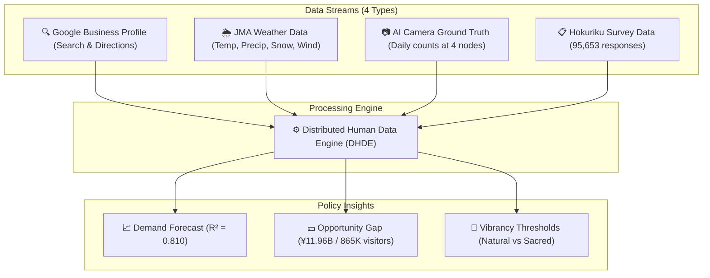
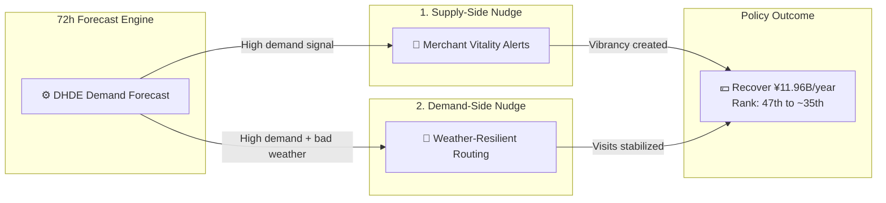

# HOKURIKU TOURISM AI GOVERNANCE STRATEGY REPORT

**Project:** Demand Forecasting and Spatial Optimization in Hokuriku Tourism using the Distributed Human Data Engine (DHDE)  
**Date:** March 1, 2026  

---

## Executive Summary

This report presents an integrated AI and data science framework to optimize tourism policy in Fukui and the wider Hokuriku region.

*   **Core challenge:** Fukui remains the **lowest-ranked prefecture (47th place)** in winter tourism volume. The root cause is not low demand but **Planning Friction**, where high digital intent fails to convert into physical visits.
*   **Quantified loss:** This friction results in **865,917 lost potential visitors per year across our 4 monitored nodes**, with an estimated economic opportunity loss of **¥11.96 billion (~$77M)**.
*   **Predictive validity:** At the primary natural node (Tojinbo), the AI model predicts daily physical arrivals from Google Maps search and Directions intent with **81% accuracy** ($R^2=0.810$). Adding weather data provides an additional +5.6% predictive gain.
*   **Policy objective:** Two AI interventions (supply-side and demand-side nudges) can realistically move Fukui from **47th place to around 35th place** nationally.

---

## 1. Reframing the Problem: Structural Stagnation and Opportunity Loss

Traditional policy diagnosis has focused on "insufficient tourism resources." Our evidence indicates a different mechanism: planning friction reduces conversion from digital intent to physical arrival.

Primary friction channels:
*   **High digital intent exists:** Google Maps Search and Directions signals show substantial interest in Fukui.
*   **Weather uncertainty blocks trips:** Snow, wind, and rain trigger cancellations, especially in winter.
*   **Under-vibrancy lowers satisfaction:** Empty streets, closed shops, and low atmospheric vitality suppress post-visit evaluation.

**Policy focus:** The priority is not new resource creation, but improving the conversion rate from existing digital intent to actual physical visits.

---

## 2. Data Architecture: Distributed Human Data Engine (DHDE)

The project integrates four data streams into one governance-grade analytical system, with geographic saturation across four nodes (Tojinbo, Fukui Station, Katsuyama, Rainbow Line).

---

## 3. Key Findings

### 3.1 Predicting Physical Arrivals and the Weather Shield Effect
This model predicts actual daily visitor arrivals at physical locations using Google Directions search intent and meteorological data.
*   **Model accuracy:** $R^2 = 0.810$ (Adj. $R^2 = 0.802$), explaining 81% of daily visitor fluctuation at Tojinbo.
*   **Top predictor:** Google Directions intent from previous days ($r = 0.781$).
*   **Policy significance:** Weather acts as an **economic gatekeeper**. Incorporating JMA weather data improves prediction accuracy by +5.6%, numerically justifying weather-adaptive routing policies.

> 
> *Figure 1: High alignment between model-predicted demand and AI-camera physical arrivals at Tojinbo.*

### 3.2 Under-Vibrancy Paradox (Kansei Text Analytics)
Morphological analysis across 70,668 text responses shows Fukui's issue is **under-tourism (under-vibrancy)** rather than overtourism.
*   Dissatisfied visitors (1★-2★) use "lonely", "closed", or "deserted" expressions **11.4x more frequently** than satisfied visitors (4★-5★).

> 
> *Figure 2: Vibrancy threshold contrast between natural and sacred destinations.*

### 3.3 Sacred Quietude Threshold at Eiheiji
Using Kansei Information Science methods, we estimate a quadratic relationship between relative crowd density and satisfaction at Eiheiji:
*   **Optimal relative density:** 47.2%, estimated as the vertex ($x^*=-\frac{b}{2a}$) of the fitted quadratic satisfaction curve.
*   **Interpretation:** Above this threshold, satisfaction declines. 
*   **Policy implication:** Sacred site policy should optimize **density quality**, not maximize volume.

### 3.4 Economic Leakage Quantification (¥11.96B Opportunity Gap)
Across the four geographically saturated nodes (Tojinbo, Fukui Station, Katsuyama, Rainbow Line):
*   **Lost visitors:** 865,917 annually.
*   **Estimated annual opportunity loss:** **¥11.96 billion (~$77M)**.
*   **Seasonal fragility:** Winter tourism is **6.29x** more weather-sensitive than summer.

> 
> *Figure 3: Estimated ranking improvement under opportunity-gap recovery scenario.*

---

## 4. Why Regional Cooperation is Mandatory: Ishikawa to Fukui Pipeline

Cross-prefectural analysis shows that tourism demand signals in Ishikawa are a significant lead indicator for Fukui arrivals.
*   **Finding:** Daily tourism activity intensity in Ishikawa predicts same-day physical arrivals at Fukui monitored tourism sites.
*   **Lead correlation:** $r = 0.537$ (statistically significant).

This implies Fukui and Ishikawa function as one practical tourism sphere (**Hokuriku Impression Space**). Single-prefecture optimization is structurally insufficient; coordinated regional data governance is required.

> 
> *Figure 4: Cross-correlation profile showing Ishikawa demand as a lead indicator for Fukui arrivals.*

---

## 5. Policy Design: Socio-Technical Nudge Loop

To recover the ¥11.96B opportunity gap, we propose two practical AI nudges:

1.  **Supply-Side Nudge (Merchant Vitality Alerts):** 72-hour demand forecasts trigger staffing and opening hour recommendations to reduce "closed shop" complaints on high-intent days.
2.  **Demand-Side Nudge (Weather-Resilient Routing):** During adverse weather, redirect coastal and outdoor demand (Tojinbo) toward indoor or sheltered nodes (Katsuyama, Eiheiji).

> 
> *Figure 5: Weather-shield routing concept across the four-node governance system.*
