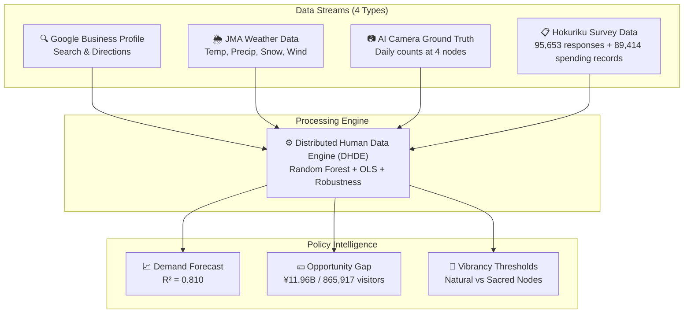
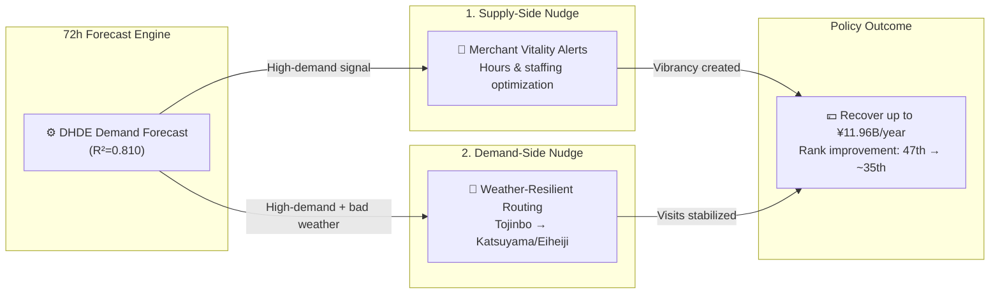

# HOKURIKU TOURISM AI GOVERNANCE STRATEGY REPORT
**Project:** Demand Forecasting and Spatial Optimization in Hokuriku Tourism using the Distributed Human Data Engine (DHDE)
**Presenter:** Amil Khanzada, Specially Appointed Assistant Professor, University of Fukui
**Submitted to:** Hokuriku Future Co-Creation Forum, Tourism DX Working Group (Kanazawa)
**Date:** March 2, 2026
**Category:** EBPM (Evidence-Based Policy Making) Strategic Brief

---

## Executive Summary

This report presents an integrated AI and data-science framework to optimize tourism policy in Fukui and the wider Hokuriku region.

- **Core challenge:** Fukui remains **47th/47** in winter tourism volume. The root cause is not low demand, but **Planning Friction**—high digital intent that fails to convert into physical visits.
- **Quantified loss:** This friction results in **865,917 lost potential visitors per year**, with an estimated **economic opportunity loss of ¥11.96 billion**.
- **Predictive validity:** The model explains **81%** of day-to-day visitor variation ($R^2=0.810$), with weather data adding **+5.6%** predictive gain.
- **Policy objective:** Two AI interventions (supply-side and demand-side nudges) can realistically move Fukui from **47th to around 35th**.

---

## 1. Reframing the Problem: Structural Stagnation and Opportunity Loss

Traditional policy diagnosis has focused on “insufficient tourism resources.” Our evidence indicates a different mechanism: **Planning Friction blocks conversion from intent to arrival**.

Primary friction channels:

- **High digital intent exists:** Google Search and Directions signals show substantial interest in Fukui.
- **Weather uncertainty blocks trips:** Snow, wind, and rain trigger cancellations, especially in winter.
- **Under-vibrancy lowers satisfaction:** “Empty streets,” “closed shops,” and low atmospheric vitality suppress post-visit evaluation.

> **Policy focus:** Not new resource creation first, but improving **conversion from existing intent to actual visits**.

---

## 2. Data Architecture: Distributed Human Data Engine (DHDE)

The project integrates four data streams into one governance-grade analytical system, with **geographic saturation** across four nodes (Tojinbo, Fukui Station, Katsuyama, Rainbow Line).

---

## 3. Key Findings

### 3.1 Predictive Performance and Weather Shield Effect
- **Model accuracy:** $R^2 = 0.810$ (Adj. $R^2 = 0.802$), explaining 81% of daily visitor fluctuation.
- **Top predictor:** Google Directions intent ($r = 0.781$).
- **Policy significance:** Weather acts as an **economic gatekeeper**; weather-aware policy design is now numerically justified.

### 3.2 Under-Vibrancy Paradox (Kansei Text Analytics)
Morphological analysis (Janome) across 70,668 text responses shows Fukui’s issue is **under-tourism (under-vibrancy)** rather than overtourism.

- Dissatisfied visitors (1–2★) use “lonely/closed/deserted” expressions **11.4x more frequently** than satisfied visitors (4–5★).

### 3.3 Sacred Quietude Threshold at Eiheiji (Joint Domain with Prof. Inoue)
Using Kansei Information Science methods, we estimate a quadratic relationship between relative crowd density and satisfaction at Eiheiji:

$$
\hat{y} = ax^2 + bx + c
$$

- **Optimal relative density:** $x^* = 47.2\%$
- **Interpretation:** Above this threshold, satisfaction declines.
- **Policy implication:** Sacred-site policy should optimize **density quality**, not maximize volume.

### 3.4 Economic Leakage Quantification (¥11.96B Opportunity Gap)
Across the four-node system:

- **Lost visitors:** 865,917 annually
- **Estimated annual opportunity loss:** **¥11.96 billion**
- **Seasonal fragility:** Winter tourism is **6.29x** more weather-sensitive than summer

---

## 4. Why Regional Cooperation is Mandatory: Ishikawa–Fukui Pipeline

Cross-prefectural analysis shows that tourism activity in Ishikawa is a significant lead indicator for Fukui arrivals.

- **Lead correlation:** $r = 0.537$ (statistically significant)

This implies Fukui and Ishikawa function as one practical tourism sphere (**Hokuriku Impression Space**). Single-prefecture optimization is structurally insufficient; coordinated regional governance is required.

---

## 5. Policy Design: Socio-Technical Nudge Loop

To recover the ¥11.96B opportunity gap, we propose two practical AI nudges:

1. **Supply-Side Nudge (Merchant Vitality Alerts)**  
   72-hour demand forecasts trigger staffing/opening-hour recommendations to reduce “closed-shop” losses on high-intent days.

2. **Demand-Side Nudge (Weather-Resilient Routing)**  
   During adverse weather, redirect coastal/outdoor demand (Tojinbo) toward indoor/sheltered nodes (Katsuyama, Eiheiji).

---

## 6. WG Discussion Items for Tomorrow

For discussion with Kanazawa University and University of Toyama colleagues:

1. **Joint data platform design:** Shared Hokuriku forecasting architecture leveraging the Ishikawa–Fukui pipeline ($r=0.537$).
2. **Co-application framework for FY2026:** Build a coordinated proposal structure for regional national-university collaborative research support.

---

## Reproducibility

- **Codebase:** [https://github.com/amilkh/hokuriku-tourism-ai-governance](https://github.com/amilkh/hokuriku-tourism-ai-governance)
- **Run command:** `python3 src/run_analysis.py`

**Status:** Unified English executive handout draft (review version, no commit)
