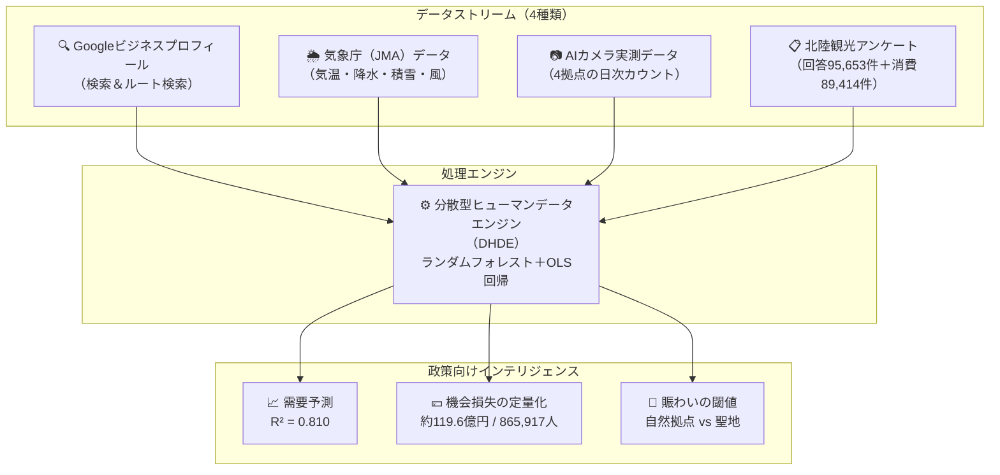
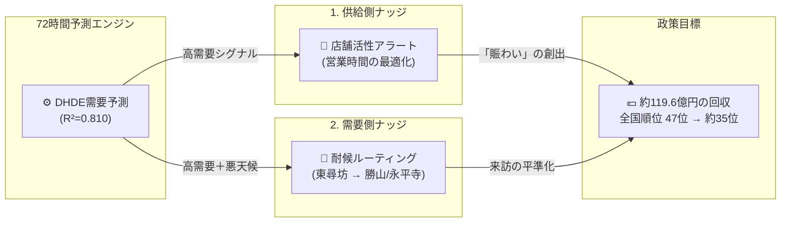

# 北陸観光AIガバナンス戦略報告書
**プロジェクト:** 分散型ヒューマンデータエンジン（DHDE）を用いた北陸観光の需要予測と空間最適化
**発表者:** 福井大学 地域創生推進本部 特命助教 カンザダ・アミル
**提出先:** 北陸未来共創フォーラム 観光DX推進WG（金沢会議）
**日付:** 2026年3月2日
**カテゴリ:** EBPM（証拠に基づく政策立案）戦略文書

---

## エグゼクティブ・サマリ

本報告書は、AIとデータサイエンスを用いて福井県および北陸地域の観光振興を最適化するための分析結果と政策提言をまとめたものです。

*   **中核課題:** 福井県は冬季の観光客数で**全国47位（最下位）**に低迷しています。根本原因は需要不足ではなく、高い訪問意図が実際の訪問に結びつかない**「計画摩擦（Planning Friction）」**にあります。
*   **損失の定量化:** この摩擦により、年間**865,917人の潜在的来訪者**が失われ、その経済的機会損失は**約119.6億円**に上ります。
*   **予測精度:** 構築したAIモデルは、日次来訪者変動の**81%**を説明します（$R^2=0.810$）。気象データの追加により精度が**+5.6%**向上しました。
*   **政策目標:** AIを用いた2つの介入（供給側および需要側ナッジ）を実施することで、全国順位を**47位から35位前後へ**引き上げることが可能です。

---

## 1. 課題の再定義：構造的低迷と経済的機会損失

従来の観光政策では「観光資源の不足」が課題とされてきましたが、本研究のデータ分析は**「計画摩擦が実訪問を阻害している」**ことを示しています。機会損失を引き起こす具体的なメカニズムは以下の通りです：

*   **高いデジタルインテント（意図）:** Google検索やルート検索のデータは、福井に対する強い関心を示しています。
*   **天候不確実性による訪問ブロック:** 特に冬季において、雪・風・雨が旅行計画のキャンセルを引き起こしています。
*   **「過少な賑わい」による満足度低下:** 「シャッターが閉まっている」「閑散としている」といった要因が、事後レビューを大きく押し下げています。

> **政策の焦点:** 新たな資源開発ではなく、**「既存需要の実訪問へのコンバージョン率（変換率）向上」**が鍵となります。

---

## 2. データアーキテクチャ：分散型ヒューマンデータエンジン（DHDE）

本プロジェクトでは、4つのデータストリームを統合した独自のシステム**「DHDE」**を構築しました。（東尋坊、福井駅、勝山、レインボーラインの4拠点で**地理的飽和**を達成）。

---

## 3. 主要な分析結果

### 3.1 予測精度と気象シールド効果
*   **モデル精度:** $R^2 = 0.810$（調整済み $R^2 = 0.802$）。単一モデルで日次変動の81%を説明。
*   **最大予測因子:** Google「ルート検索」意図（$r = 0.781$）。
*   **政策的示唆:** 天候は「経済のゲートキーパー」として機能しており、天候適応型の政策（全天候型施設への誘導等）の有効性が数値で裏付けられました。

### 3.2 過少な賑わいパラドックス（テキスト感性分析）
70,668件のレビューテキストを形態素解析（Janome）した結果、福井の本質的課題はオーバーツーリズムではなく**「アンダーツーリズム（過少な賑わい）」**であることが判明しました。
*   **1〜2★（低満足度）**の層は、4〜5★の層に比べ「寂しい・店が閉まっている」という表現を**11.4倍**多く使用しています。

### 3.3 聖地における静寂の閾値（永平寺） — *井上教授（福井大）との共同研究領域*
感性情報科学のアプローチを用い、永平寺（禅の聖地）における「相対密度」と「満足度」の関係を2次回帰で推定しました。（$\hat{y} = ax^2 + bx + c$）

*   **最適密度（$x^*$）:** **47.2%**（この点で満足度が最大化）
*   **ファジィルール（政策的示唆）:** 密度が47.2%を超えると満足度が低下に転じます。聖地体験の保全の鍵は、訪問者数の最大化ではなく**「静寂を維持する密度管理」**にあります。

### 3.4 機会損失の定量化（約119.6億円の漏出）
*   **失われた来訪者:** 年間 **865,917人**（4拠点合計）。
*   **推定経済損失:** **約119.6億円/年**（来訪者単価 × 失われた来訪者）。
*   **季節的脆弱性:** 冬季は夏季の**6.29倍**も天候に敏感であり、冬季対策が最優先課題です。

---

## 4. 広域連携の必然性：石川・福井データパイプライン

**発見:** 石川県での観光活動シグナルは、福井県への実来訪を**先行して（Lead）**予測します。
*   **先行相関係数:** **$r = 0.537$**（統計的に有意）。
*   **政策的示唆:** 福井と石川は単一の観光圏（**北陸印象空間 / Hokuriku Impression Space**）として機能しています。単県での政策設計では最適化できず、**北陸広域でのガバナンスとデータ連携が不可欠**です。

---

## 5. 政策提言：社会技術ナッジループ

約119.6億円の機会損失を回収するため、AIによる2つの「ナッジ（行動変容を促す仕掛け）」を提案します。

1.  **供給側ナッジ（店舗活性アラート）:** 72時間前の需要予測を用いて、地元店舗に最適な営業時間と人員配置を推奨し、高需要日の「閑散状態」を防ぎます。
2.  **需要側ナッジ（耐候ルーティング）:** 悪天候時、東尋坊（沿岸/屋外）への訪問者を自動的に勝山や永平寺（屋内/山間部）へ誘導し、悪天候による県外への機会損失を最小化します。

---

## 6. 次のステップ（WGでの協議事項）

本日のWGにおきまして、以下の連携について金沢大学・富山大学の先生方と意見交換させていただけますと幸いです。

1.  **共同データプラットフォームの構築:** 石川・福井のパイプライン（$r=0.537$）を活用した、北陸3県でのAI需要予測モデルの共有。
2.  **次年度活動に向けた共同申請:** 令和8年度「北陸地区国立大学学術研究連携支援」等への共同申請体制の構築。

**再現性担保のためのコード公開:** [github.com/amilkh/hokuriku-tourism-ai-governance](https://github.com/amilkh/hokuriku-tourism-ai-governance)
