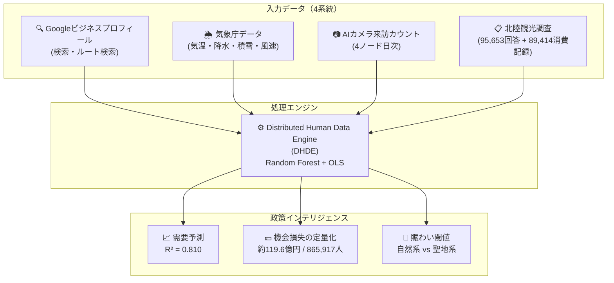
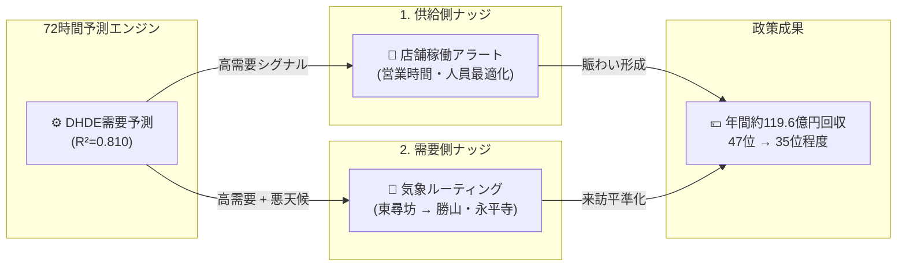

# 北陸観光AIガバナンス戦略レポート

**プロジェクト名:** 北陸観光における需要予測・空間最適化のための分散型ヒューマンデータエンジン（DHDE）
**著者:** アミル・カーンザダ（福井大学 特命准教授）
**提出先:** 北陸観光・AI政策委員会（金沢会議）
**日付:** 2026年2月27日
**分類:** EBPM（Evidence-Based Policy Making）戦略文書

---

## エグゼクティブサマリー

本レポートは、福井県観光の再活性化に向けて、AIとデータサイエンスに基づく分析結果と政策提言を示すものです。

- **中核課題:** 福井県は冬季観光客数で **47位（最下位）**。本研究は、原因を「需要不足」ではなく、デジタル需要が実来訪に転換しない **計画摩擦（Planning Friction）** と定義します。
- **損失規模:** 年間 **865,917人** の潜在来訪者機会を失い、経済損失は **約119.6億円（Satake Number）**。
- **モデル精度:** 日次来訪変動の **81%** を説明（$R^2=0.810$）。気象データ追加で精度 **+5.6%** 改善。
- **政策目標:** 供給側・需要側の2つのAI介入により、順位を **47位→35位程度** へ改善可能。

---

## 1. 課題定義：構造的停滞と経済機会損失

福井県は、冬季観光客数で全国47都道府県中、構造的に最下位が継続しています。

**従来の誤診:** 「観光資源が不足している」
**本研究の再定義:** 「**計画摩擦（Planning Friction）** が実来訪を阻害している」

機会損失を生む具体メカニズム：

- **デジタル需要は高い** — Google検索・ルート検索には強い関心が出ている
- **気象不確実性が来訪を中断** — 冬季の降雪・降雨・強風で計画がキャンセルされる
- **賑わい不足が満足度を低下** — 「閑散としている」体験が評価を下げる

> **政策焦点:** 新規資源の追加より、既存需要の **転換率（intent → visit）改善** が最重要。

---

## 2. データアーキテクチャ：分散型ヒューマンデータエンジン（DHDE）

本研究では、4系統データを統合する独自基盤 **DHDE** を構築しました。

**地理的4ノード（地理的飽和を達成）**

| ノード | 地点 | 特徴 |
|------|------|------|
| Node A: 東尋坊・三国 | 北（沿岸） | 自然景勝地、気象感度最大 |
| Node B: 福井駅周辺 | 中央（ハブ） | 交通結節点 |
| Node C: 勝山・恐竜博物館 | 南（山側） | 通年集客拠点 |
| Node D: レインボーライン・若狭 | 東（景観） | 季節性1.85倍、積雪影響最大 |

---

## 3. 主要分析結果

### 3.1 予測精度とWeather Shield効果

**モデル精度:** $R^2 = 0.810$（調整済み $R^2 = 0.802$）

- 単一モデルで日次来訪変動の **81%** を説明
- 最大予測因子は Google「ルート検索」（$r = 0.781$）
- 気象データ導入で精度 **+5.6%** 改善
- **政策含意:** 気象は経済活動の「ゲートキーパー」であり、気象適応施策の有効性を数値で裏付け

> 📊 *図1: 需要予測（赤）とAIカメラ実測（青）が高一致（$R^2=0.810$）し、EBPMの有効性を示す*

---

### 3.2 過少賑わいパラドックス（テキスト感性分析）

**分析対象:** 70,668件レビュー（形態素解析: Janome）

- **低満足（1–2★）層** は「寂しい・閑散」語を高満足層比で **11.4倍** 使用
- 福井の中核問題は「オーバーツーリズム」ではなく **アンダーツーリズム（過少賑わい）**
- **政策含意:** 「人が集まるから人が集まる」賑わい循環を作る介入が必要

> 📊 *図2: 1★群（寂しさ語）と5★群（賑わい語）の出現頻度比較（1,000レビューあたり）*

---

### 3.3 経済損失の定量化（Satake Number: 約119.6億円）

> **⚠️ 年間機会損失: 865,917人 / 約119.6億円**

この値を政策介入目標として **Satake Number** と定義します。

**内訳:**

- 対象: 4ノード合算（地理的飽和後）
- 損失来訪者: **865,917人/年**
- 経済損失推計: **約119.6億円/年**（1人あたり消費額 × 損失来訪者）
- 冬季は夏季比 **6.29倍** の気象感度 → 冬季対策を最優先

> 📊 *図3: 865,917人回復時、福井は47位から35位程度まで改善可能*

---

### 3.4 聖地静寂閾値（永平寺）— 井上教授との共同研究

**本節は福井大学感性情報学・井上教授との共同研究成果に基づきます。**

永平寺（禅の聖地）における **相対混雑率と満足度** の関係を二次回帰で推定しました。

**モデル:** $\hat{y} = ax^2 + bx + c$

| パラメータ | 値 |
|-----------|-------|
| $a$ | $1.858 \times 10^{-5}$ |
| $b$ | $-1.754 \times 10^{-3}$ |
| $c$ | $4.304$ |
| **最適混雑率 $x^*$** | **47.2%**（満足度最大） |
| **最大満足度 $\hat{y}(x^*)$** | **4.26 / 5.00** |

**政策含意（ファジールール）:**

- 相対混雑率が **47.2%** を超えると満足度は低下開始
- 聖地価値維持は「最大集客」ではなく「静寂を保つ密度制御」が鍵
- 文化価値の定量化は、感性情報学による文化資産政策の実装例

> 📊 *図4: 永平寺の相対混雑率と満足度の二次回帰（頂点47.2%）*

---

## 4. 広域連携の必要性：石川→福井データパイプライン

**発見:** 石川県の観光活動シグナルが、福井県来訪実績を先行して説明します。

- **先行相関係数:** $r = 0.537$（統計的有意）
- **政策含意:** 福井と石川は単独ではなく、**一体的観光圏（Hokuriku Impression Space）**
- 単県最適では限界があり、**北陸広域ガバナンス** が必須

**広域政策設計の方向性:**

1. 感性誘導（期待形成）— 石川側情報発信が福井流入を促進
2. 行動誘導（実行設計）— 周遊ルート最適化で広域回遊を促進
3. データ協調基盤 — 共同補助金申請の土台となる統合プラットフォーム構築

---

## 5. 政策提案：Socio-Technical Nudge Loop

約119.6億円の機会損失回収に向け、2つのAI介入を提案します。

### 介入1: 供給側ナッジ（店舗稼働アラート）

> **72時間需要予測** に基づき、店舗・飲食の営業時間・人員配置を最適化。
> 高需要日に「開いていない・人がいない」状態を防ぎ、賑わい循環を形成。

### 介入2: 需要側ナッジ（気象ルーティング）

> 悪天候時、東尋坊（沿岸・屋外）来訪予定者を勝山・永平寺（内陸・屋内）へ自動誘導。
> 気象要因による機会損失を最小化し、域内来訪を平準化。

---

## 6. 実行アクションと委員会提言

### 直近アクション（2026年春〜）

- [ ] 気象連動来訪誘導システムのプロトタイプ構築（福井・石川共同）
- [ ] 4ノードAIカメラのリアルタイム共有基盤整備
- [ ] 東尋坊・三国エリアで需要予測アラート運用を試行

### 中期計画（2026–2027）

- [ ] 北陸広域ガバナンス会議体の設置（石川・福井・富山）
- [ ] 永平寺密度制御の感性工学検証（井上研究室との共同）
- [ ] JST・観光庁EBPM系共同補助金の申請

### 継続研究

- [ ] DHDEの全国47都道府県スケール展開可能性評価
- [ ] Satake Number年次モニタリングの制度化
- [ ] インバウンド対応の多言語感性分析

---

## 参考主要指標

| 指標 | 値 |
|------|------|
| モデル精度（$R^2$） | **0.810**（調整済み0.802） |
| 最大予測因子 | Googleルート検索（$r=0.781$） |
| 気象データ寄与 | 精度 **+5.6%** |
| 年間損失来訪者 | **865,917人** |
| 年間経済損失（Satake Number） | **約119.6億円** |
| 冬季/夏季の気象感度比 | **6.29倍** |
| 石川→福井先行相関 | $r = 0.537$ |
| 永平寺静寂最適密度 | **47.2%** |
| 過少賑わい語比（1★/5★） | **11.4倍** |
| 目標順位改善 | **47位 → 35位程度** |

---

**検証状態:** 4ノードで地理的飽和を達成。Satake Number（約119.6億円）を年次政策介入目標として確認。

**再現コード:** [github.com/amilkh/hokuriku-tourism-ai-governance](https://github.com/amilkh/hokuriku-tourism-ai-governance)
**実行コマンド:** `python3 src/run_analysis.py`
