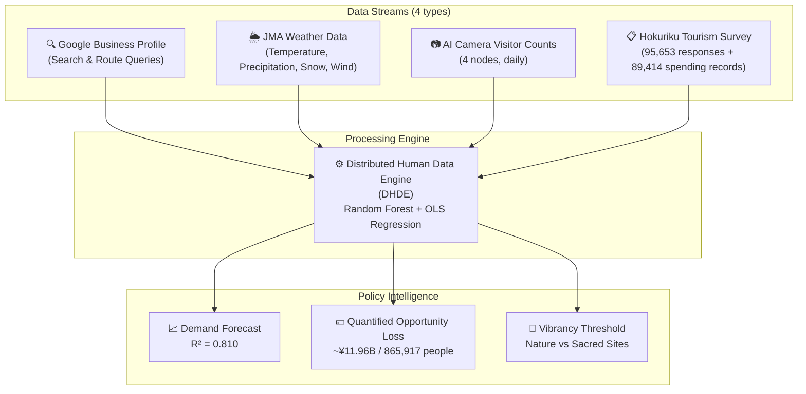
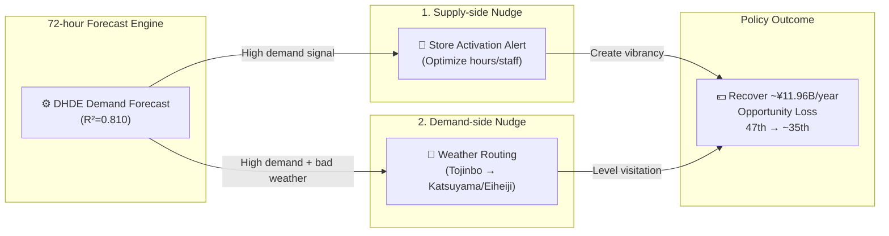

# HOKURIKU TOURISM AI GOVERNANCE STRATEGY REPORT

**Project Name:** Distributed Human Data Engine for Demand Forecasting and Spatial Optimization in Hokuriku Tourism
**Author:** Amil Khanzada, Associate Professor, University of Fukui
**Submitted to:** Hokuriku Tourism & AI Policy Committee (Kanazawa Conference)
**Date:** February 27, 2026
**Category:** Evidence-Based Policy Making (EBPM) Strategy Document

---

## Executive Summary

This report summarizes the analysis results and policy recommendations for revitalizing tourism in Fukui Prefecture using AI and data science.

- **Core Issue:** Fukui ranks **47th (last)** in winter tourist numbers. The root cause is not lack of demand, but **"Planning Friction"**—a gap where high digital intent does not convert to actual visits.
- **Quantified Loss:** Annually, **865,917 potential visitors** are lost, with an economic loss of **~¥11.96 billion** (the "Satake Number").
- **Accuracy:** The AI model explains **81%** of daily visitor variation ($R^2=0.810$). Adding weather data improves accuracy by **+5.6%**.
- **Policy Goal:** Implementing two AI interventions (supply-side and demand-side nudges) could improve the ranking from **47th to about 35th**.

---

## 1. Problem Definition: Structural Stagnation and Economic Opportunity Loss

Fukui Prefecture has been **structurally last** among Japan's 47 prefectures for winter tourism numbers.

**Conventional Misdiagnosis:** "Lack of tourism resources."
**This Study's Redefinition:** "**Planning Friction** is blocking actual visits."

Specific mechanisms causing opportunity loss:

- **High digital intent** — Google search and route queries show strong interest
- **Weather uncertainty blocks visits** — Especially in winter, snow, wind, and rain cause people to abandon plans
- **Lack of vibrancy lowers satisfaction** — "Deserted shopping streets" negatively impact reviews

> **Policy Focus:** The key is not developing new resources, but **improving the conversion rate of existing demand**.

---

## 2. Data Architecture: Distributed Human Data Engine (DHDE)

This project built a unique system, **DHDE**, integrating four data streams.

**4 Geographic Nodes (Full Geographic Saturation):**

| Node | Location | Feature |
|------|----------|---------|
| Node A: Tojinbo/Mikuni | North (Coast) | Nature site, highest weather sensitivity |
| Node B: Fukui Station | Central (Hub) | Transport hub |
| Node C: Katsuyama/Dinosaur Museum | South (Mountain) | Year-round attraction |
| Node D: Rainbow Line/Wakasa | East (Scenic) | 1.85x seasonality, max snow impact |

---

## 3. Key Analysis Results

### 3.1 Forecast Accuracy & Weather Shield Effect

**Model accuracy:** $R^2 = 0.810$ (adj. $R^2 = 0.802$)

- Explains **81%** of daily visitor variation with a single model
- Top predictor: Google "Directions" intent ($r = 0.781$)
- Adding JMA weather data improves accuracy by **+5.6%**
- **Policy implication:** Weather acts as an "economic gatekeeper"; weather-adaptive policies are numerically validated

> 📊 *Figure 1: Demand forecast (red) and AI camera actual (blue) show high agreement ($R^2=0.810$)—proving EBPM effectiveness*

---

### 3.2 Under-vibrancy Paradox (Text Sentiment Analysis)

**Target:** 70,668 review texts (morphological analysis: Janome)

- **1–2★ (low satisfaction)** group uses "lonely/deserted" expressions **11.4x** more than 4–5★ group
- Fukui's core issue is "**under-vibrancy**"—not over-tourism, but under-tourism
- **Policy implication:** Need for vibrancy-creating policies that generate a "come because it's crowded" virtuous cycle

> 📊 *Figure 2: Sentiment keyword frequency for 1★ (loneliness) vs 5★ (vibrancy) per 1,000 reviews*

---

### 3.3 Quantifying Economic Loss ("Satake Number": ~¥11.96B)

> **⚠️ Annual Opportunity Loss: 865,917 people / ~¥11.96B**

This value is defined as the "Satake Number" and presented as a policy intervention benchmark.

**Details:**

- Target: Total of 4 nodes (after geographic saturation)
- Lost visitors: **865,917/year**
- Estimated economic loss: **~¥11.96B/year** (spending per visitor × lost visitors)
- **Winter is 6.29x** more sensitive to weather than summer—winter countermeasures are top priority

> 📊 *Figure 3: If AI governance recovers 865,917 visitors, Fukui improves from 47th to about 35th place*

---

### 3.4 Sacred Site Quietude Threshold (Eiheiji) — Joint Research with Prof. Inoue

**This section is based on joint research with Prof. Inoue (Kansei Information Science, University of Fukui).**

For Eiheiji (Zen sacred site), the relationship between **relative visitor density and satisfaction** was estimated using quadratic regression.

**Mathematical model:** $\hat{y} = ax^2 + bx + c$

| Parameter | Value |
|-----------|-------|
| $a$ | $1.858 \times 10^{-5}$ |
| $b$ | $-1.754 \times 10^{-3}$ |
| $c$ | $4.304$ |
| **Optimal density $x^*$** | **47.2%** (max satisfaction) |
| **Max satisfaction $\hat{y}(x^*)$** | **4.26 / 5.00** |

**Policy implications (fuzzy rules):**

- When relative density exceeds **47.2%**, satisfaction starts to decline
- The key to preserving the sacred site experience is **managing density to maintain quietude**, not maximizing visitor numbers
- Quantifying cultural value is a practical example of data-driven cultural property policy using kansei information science

> 📊 *Figure 4: Quadratic regression of relative density and satisfaction at Eiheiji (peak: 47.2%)*

---

## 4. Need for Regional Collaboration: Ishikawa-Fukui Data Pipeline

**Finding:** Tourism activity signals in Ishikawa **lead** actual visitor numbers in Fukui.

- **Lead correlation coefficient:** $r = 0.537$ (statistically significant)
- **Policy implication:** Fukui and Ishikawa function as a **single tourism region (Hokuriku Impression Space)**
- Single-prefecture policy design cannot optimize; **broader Hokuriku governance is essential**

**Directions for regional policy design:**

1. Kansei guidance (expectation formation)—information dissemination in Ishikawa drives inflow to Fukui
2. Mobility guidance (behavior implementation)—designing routes to encourage travel within Hokuriku
3. Data collaboration platform—building a joint data platform (basis for joint grant applications)

---

## 5. Policy Proposals: Socio-Technical Nudge Loop

To recover the ~¥11.96B opportunity loss, two AI interventions are proposed.

### Intervention 1: Supply-side Nudge (Store Activation Alert)

> **72-hour demand forecasts** are used to recommend optimal opening hours and staffing to local stores and restaurants.
> Prevents "deserted" conditions on high-demand days and creates a **virtuous cycle of vibrancy**.

### Intervention 2: Demand-side Nudge (Weather Routing)

> **During bad weather**, visitors to Tojinbo (coast/outdoor) are automatically guided to Katsuyama and Eiheiji (indoor/mountain).
> Minimizes weather-related opportunity loss and **levels out visitation**.

---

## 6. Action Items & Committee Recommendations

### Immediate Actions (Spring 2026~)

- [ ] Build prototype **weather-linked visitor attraction system** (Fukui & Ishikawa joint project)
- [ ] Develop **real-time data sharing platform** for 4-node AI camera data
- [ ] Pilot **demand forecast alerts** for local stores (Tojinbo/Mikuni area)

### Mid-term Plan (2026–2027)

- [ ] Establish **Hokuriku Regional Governance Council** (Ishikawa, Fukui, Toyama collaboration)
- [ ] Kansei engineering validation of Eiheiji density management (joint research with Prof. Inoue's group)
- [ ] Joint grant applications: **JST, Japan Tourism Agency EBPM grants**

### Ongoing Research

- [ ] Explore **scaling DHDE model to all 47 prefectures**
- [ ] Build annual monitoring system for "Satake Number"
- [ ] Multilingual sentiment analysis (for inbound tourism)

---

## Reference: Key Metrics

| Metric | Value |
|--------|-------|
| Model accuracy ($R^2$) | **0.810** (adj. 0.802) |
| Top predictor | Google Directions ($r=0.781$) |
| Weather data contribution | **+5.6%** accuracy gain |
| Annual lost visitors | **865,917** |
| Annual economic loss (Satake Number) | **~¥11.96B** |
| Winter vs summer weather sensitivity | **6.29x** |
| Ishikawa→Fukui lead correlation | $r = 0.537$ |
| Eiheiji quietude threshold (optimal density) | **47.2%** |
| Under-vibrancy sentiment ratio (1★/5★) | **11.4x** |
| Target rank improvement | **47th → ~35th** |

---

**Validation Status:** Full geographic saturation achieved with 4 camera nodes. The "Satake Number" (~¥11.96B) is confirmed as the annual opportunity loss for policy intervention.

**Reproducible Code:** [github.com/amilkh/hokuriku-tourism-ai-governance](https://github.com/amilkh/hokuriku-tourism-ai-governance)
**Analysis Pipeline:** All results reproducible with `python3 src/run_analysis.py`
