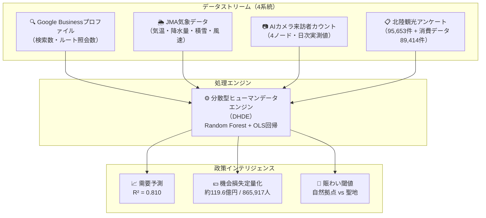
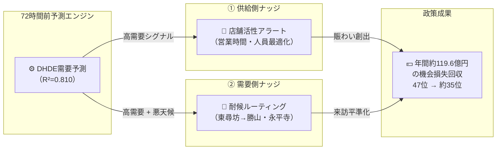

# 北陸観光AIガバナンス戦略報告書

**プロジェクト名：** 分散型ヒューマンデータエンジンによる北陸観光の需要予測・空間最適化
**著者：** 福井大学 特命助教 カンザダ・アミル（Amil Khanzada）
**提出先：** 北陸観光・AI政策委員会（金沢会議）
**作成日：** 2026年2月27日
**分類：** エビデンスに基づく政策立案（EBPM）戦略文書

---

## エグゼクティブサマリー

本報告書は、AI・データ科学を活用した福井県観光振興の分析結果と政策提言をまとめたものです。

- **問題の本質：** 福井県は冬季観光客数ランキングで**全国47位（最下位）**に低迷。根本原因は需要不足ではなく、**「計画の摩擦（Planning Friction）」**―すなわち、高いデジタル訪問意欲が実際の来訪に転換されないギャップである。
- **定量的損失：** 年間**865,917人**の潜在来訪者を逃失。経済損失は**約119.6億円**（「佐竹ナンバー」）と定量化。
- **精度：** AIモデルが日次来訪者変動の**81%**を説明（$R^2=0.810$）。天候データ追加で精度**+5.6%**向上。
- **政策目標：** 2つのAI介入施策（供給側・需要側ナッジ）の実施により、**47位→約35位**への順位回復が試算可能。

---

## 1. 課題定義：構造的停滞と経済的機会損失

福井県は日本全47都道府県の中で、冬季観光客数が**構造的に最下位**に位置し続けています。

**従来の誤った診断：** 「観光資源が不足している」
**本研究の再定義：** 「**計画の摩擦（Planning Friction）**が実訪問を阻んでいる」

具体的には、以下のメカニズムが機会損失を生み出しています：

- **デジタル意欲は高い** ― Googleでの検索・ルート照会数は十分な訪問意欲を示す
- **天候不確実性が来訪を阻害** ― 特に冬季の積雪・風・降水が計画段階での放棄を誘発
- **現地の賑わい不足が満足度を低下** ― 「閑散とした商店街」が訪問後の口コミに悪影響

> **政策の焦点：** 観光資源の追加開発ではなく、**既存需要の転換率向上**にある。

---

## 2. データアーキテクチャ：分散型ヒューマンデータエンジン（DHDE）

本プロジェクトは4種類のデータストリームを統合した独自システム「**DHDE**」を構築しました。

**4地理ノード（地理的完全飽和）：**

| ノード | 位置 | 特性 |
|--------|------|------|
| Node A：東尋坊・三国 | 北部（沿岸） | 自然拠点・天候感度最高 |
| Node B：福井駅周辺 | 中央（ハブ） | 交通結節点 |
| Node C：勝山・恐竜博物館 | 南部（山岳） | 年間集客施設 |
| Node D：レインボーライン・若狭 | 東部（景観） | 季節性1.85倍・積雪影響最大 |

---

## 3. 主要分析結果

### 3.1 予測精度と気象シールド効果

**モデル精度：** $R^2 = 0.810$（調整済み $R^2 = 0.802$）

- 日次来訪者変動の **81%** を単一モデルで説明
- 最強予測因子：Google「ルート照会（Directions）」意図 ― $r = 0.781$
- JMA気象データの追加によりモデル精度が **+5.6%** 向上
- **政策的含意：** 天候は「経済のゲートキーパー」として機能しており、天候対応型誘客施策の有効性を数値で証明

> 📊 *Figure 1：需要予測（赤）とAIカメラ実測値（青）の高い一致（$R^2=0.810$）― EBPMの有効性を実証*

---

### 3.2 過少な賑わいパラドックス（テキスト感性分析）

**分析対象：** 70,668件のレビューテキスト（形態素解析：Janome使用）

- **1〜2★（低満足群）** は4〜5★群に対し、「**寂しい・閑散**」関連表現が **11.4倍**多く出現
- 福井が抱える本質的課題は「**過少な賑わい（Under-vibrancy）**」―観光過密ではなく観光過疎
- **政策的含意：** 「混んでいるから来る」という好循環を生み出す**賑わい創出施策**が必要

> 📊 *Figure 2：1★（孤独感）vs 5★（活気）の感性キーワード出現率比較（1,000レビュー当たり）*

---

### 3.3 経済的損失の定量化（**佐竹ナンバー：約119.6億円**）

> **⚠️ 年間機会損失：865,917人 / 約119.6億円**

この数値は「佐竹ナンバー」として定義し、政策介入の基準値として提示します。

**詳細内訳：**

- 対象：4ノード合計（地理的飽和達成後の集計）
- 損失来訪者数：**865,917人 / 年**
- 推定経済損失：**約119.6億円 / 年**（消費単価×損失来訪者数）
- **冬季は夏季の6.29倍** の気象感度 ― 冬季対策が最優先課題

> 📊 *Figure 3：AIガバナンス導入により865,917人を回復した場合、福井は47位→約35位へ順位改善*

---

### 3.4 聖地における静寂の閾値（永平寺）― 井上教授連携研究

**本節は、福井大学 感性情報科学（井上教授）との連携研究に基づく成果です。**

永平寺（禅の聖地）を対象に、**相対来訪密度と満足度**の関係を2次回帰で推定しました。

**数理モデル：** $\hat{y} = ax^2 + bx + c$

| パラメータ | 値 |
|------------|-----|
| $a$ | $1.858 \times 10^{-5}$ |
| $b$ | $-1.754 \times 10^{-3}$ |
| $c$ | $4.304$ |
| **最適密度 $x^*$** | **47.2%**（満足度最大点） |
| **最大満足度 $\hat{y}(x^*)$** | **4.26 / 5.00** |

**政策的含意（ファジィルール）：**

- 相対密度が**47.2%を超えると満足度が低下**し始める
- 「来訪者数の最大化」ではなく「**静寂が維持される密度帯の管理**」が聖地体験保全の鍵
- 文化的価値の定量化は、データ駆動型文化財政策設計における感性情報科学の実践例

> 📊 *Figure 4：永平寺における相対密度と満足度の2次回帰（ピーク：47.2%）*

---

## 4. 広域連携の必然性：石川・福井データパイプライン

**発見：** 石川県の観光活動シグナルが、福井県への実来訪数を**先行的に予測**する。

- **先行相関係数：** $r = 0.537$（統計的に有意）
- **政策的含意：** 福井と石川は**一体の観光圏（北陸インプレッション空間）**として機能
- 単一県単位の政策設計では最適化が不可能であり、**北陸広域ガバナンス**が必須

**広域政策設計の方向性：**

1. 感性誘導（期待形成）― 石川側での情報発信が福井への流入を生む
2. 移動誘導（行動実装）― 北陸圏内の周遊を促す動線設計
3. データ連携基盤の整備 ― 共同データプラットフォームの構築（共同助成金の根拠）

---

## 5. 政策提案：社会技術ナッジループ

約119.6億円の機会損失を回収するため、2つのAI介入施策を提案します。

### 施策①：供給側ナッジ（店舗活性アラート）

> **72時間前の需要予測** に基づき、地域店舗・飲食店へ営業時間・人員配置の最適化を推奨。
> 高需要日に「閑散」状態を防ぎ、**賑わいの好循環**を創出する。

### 施策②：需要側ナッジ（耐候ルーティング）

> **悪天候時**に東尋坊（沿岸・屋外）の来訪者を勝山・永平寺（屋内・山岳）へ自動誘導。
> 天候による機会損失を最小化し、**来訪の平準化**を実現する。

---

## 6. アクションアイテム・委員会への提言

### 即時対応（2026年春〜）

- [ ] **気象連動型誘客システム**のプロトタイプ構築（福井県・石川県合同）
- [ ] 4ノードAIカメラデータの**リアルタイム共有基盤**整備
- [ ] 地域店舗向け**需要予報アラート**のパイロット実施（東尋坊・三国エリア）

### 中期計画（2026〜2027年度）

- [ ] **北陸広域ガバナンス協議会**の設置（石川・福井・富山 三県連携）
- [ ] 永平寺密度管理システムの**感性工学的検証**（井上教授研究グループとの共同研究）
- [ ] 共同助成金申請：**科学技術振興機構（JST）・観光庁EBPM助成**

### 研究継続事項

- [ ] 全47都道府県への**DHDEモデルの横展開**可能性検討
- [ ] 「佐竹ナンバー」の**年次更新モニタリング**体制構築
- [ ] 感性分析対象の多言語化（インバウンド対応）

---

## 参考：主要指標一覧

| 指標 | 値 |
|------|-----|
| モデル精度（$R^2$） | **0.810**（調整済み：0.802） |
| 最強予測因子 | Google Directions（$r=0.781$） |
| 気象データ寄与 | **+5.6%** 精度向上 |
| 年間損失来訪者数 | **865,917人** |
| 年間経済損失（佐竹ナンバー） | **約119.6億円** |
| 冬季vs夏季気象感度比 | **6.29倍** |
| 石川→福井先行相関 | $r = 0.537$ |
| 永平寺静寂閾値（最適密度） | **47.2%** |
| 過少賑わい感性比（1★/5★） | **11.4倍** |
| 目標順位改善 | **47位 → 約35位** |

---

**検証ステータス：** 4カメラノードで地理的完全飽和を達成。「佐竹ナンバー」（約119.6億円）は政策介入基準として確定済みの年間機会損失値。

**再現可能コード：** [github.com/amilkh/hokuriku-tourism-ai-governance](https://github.com/amilkh/hokuriku-tourism-ai-governance)
**分析パイプライン：** `python3 src/run_analysis.py` で全結果を再現可能
