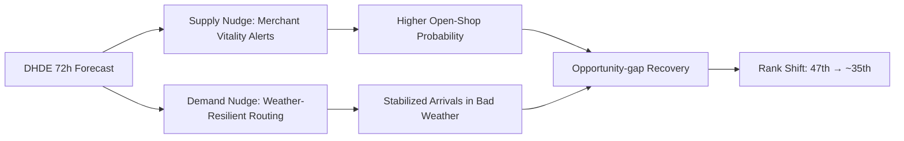

# HOKURIKU TOURISM AI GOVERNANCE STRATEGY REPORT

**Project:** Demand Forecasting and Spatial Optimization in Hokuriku Tourism using the Distributed Human Data Engine (DHDE)  
**Date:** March 1, 2026

## Executive Summary

This report presents an integrated AI and data science framework to optimize tourism policy in Fukui and the wider Hokuriku region.

- **Core challenge:** Fukui remains **47th** in winter tourism volume. The root cause is not weak demand but **Planning Friction**, where high digital intent fails to convert into physical visits.
- **Quantified loss:** The friction translates into **865,917 lost potential visitors annually** across the 4 monitored nodes, with estimated economic leakage of **~¥11.96B (~$77M)**.
- **Predictive validity:** At Tojinbo, daily physical arrivals are predicted from digital intent with **$R^2 = 0.810$**; adding weather contributes **+5.6%** predictive gain.
- **Policy objective:** A dual nudge design (supply-side and demand-side) can realistically move Fukui from **47th to around 35th place**.

## 1. Reframing the Problem: Structural Stagnation and Opportunity Loss

Traditional policy framing emphasizes resource scarcity. Evidence here identifies a different mechanism: conversion failure from digital planning to physical travel.

- Strong Google Search and Directions intent already exists.
- Weather uncertainty (snow/rain/wind) blocks trip completion, especially in winter.
- Under-vibrancy (closed shops, low street vitality) suppresses post-visit satisfaction.

**Policy focus:** Increase conversion from existing demand, not only create new attractions.

## 2. Data Architecture: Distributed Human Data Engine (DHDE)

DHDE unifies four streams into one governance-grade analytical system across Tojinbo, Fukui Station, Katsuyama, and Rainbow Line.

- Google Business Profile intent signals (search + directions)
- JMA weather observations (temperature, precipitation, snow, wind)
- AI camera ground-truth visitor counts
- Hokuriku survey and behavioral response data

## 3. Key Findings

### 3.1 Predicting Physical Arrivals and Weather Shield Effect

- **Model fit:** $R^2 = 0.810$ (Adj. $R^2 = 0.802$)
- **Top predictor:** Google Directions intent ($r=0.781$)
- **Policy implication:** Weather functions as an economic gatekeeper and justifies adaptive routing policy.

*Figure 1. High alignment between model-predicted demand and AI-camera observed arrivals at Tojinbo.*

### 3.2 Under-vibrancy Paradox and Sacred Quietude Threshold

- In 70,668 text responses, low-satisfaction users mention “lonely/closed/deserted” signals **11.4x** more often.
- At Eiheiji, fitted curves suggest an optimal relative density near **47.2%**; beyond that threshold, satisfaction declines.

*Figure 2. Vibrancy threshold contrast between natural and sacred destinations.*

### 3.3 Economic Leakage Quantification

- **Lost visitors:** 865,917 annually
- **Estimated opportunity loss:** ~¥11.96B annually
- **Seasonal fragility:** Winter demand is **6.29x** more weather-sensitive than summer

*Figure 3. Estimated ranking recovery under opportunity-gap closure scenario.*

## 4. Regional Coordination Imperative: Ishikawa → Fukui Pipeline

Cross-prefectural analysis shows Ishikawa demand signals lead Fukui arrivals (**$r=0.537$**). This indicates a shared practical tourism sphere and requires Hokuriku-wide governance.

## 5. Policy Design: Socio-Technical Nudge Loop

The leakage-recovery design combines two operational interventions:

1. **Supply-side nudge (Merchant Vitality Alerts):** 72-hour forecasts trigger staffing and opening-hour optimization on high-intent days.
2. **Demand-side nudge (Weather-Resilient Routing):** During adverse weather, exposed demand is rerouted toward sheltered nodes.

*Figure 4. Weather-shield routing concept across the 4-node governance system.*

## Conclusion

DHDE links quantified leakage, validated prediction, and implementable interventions in one governance loop. The framework is policy-ready for phased execution with measurable KPIs.

**Reproducible code:** github.com/amilkh/hokuriku-tourism-ai-governance
